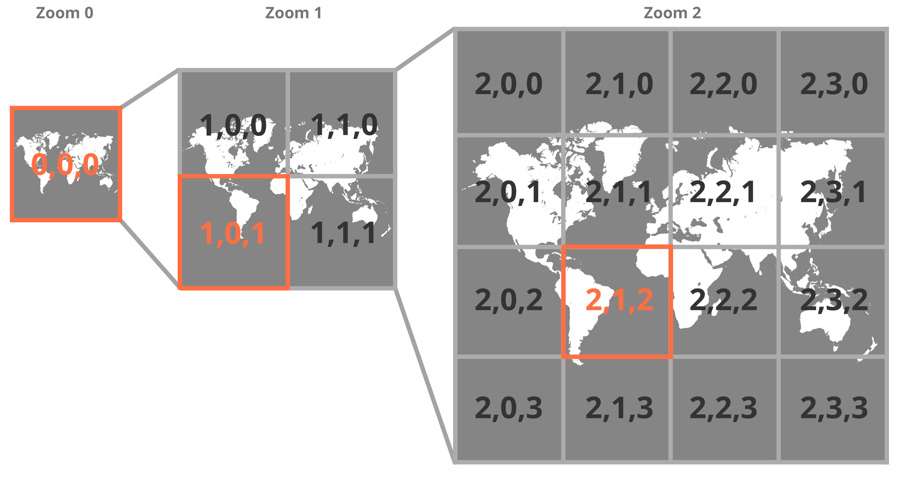

import CustomAside from '@/components/CustomAside.astro';

<CustomAside type="excerpt">{frontmatter.description}</CustomAside>


## Web Maps

<figure>


Three zoom levels in a map tileset. The labels in our graphic follow the z (zoom), x (longitude position), and y (latitude position) format of tileset templates.

</figure>


## Create a Map with Leaflet


<CustomAside type="excerpt" reference="Exercise 10.2.1"></CustomAside>


There are several JavaScript frameworks that make it easy to create maps. This demo uses Leaflet, which is free, open source, and mobile friendly. In this exercise you will set up a new map view and change the base layer using Leaflet and Codepen.

1. Make a copy of our Leaflet Starter by pressing the Fork button in the lower right corner on Codepen at [criticalwebdesign.github.io#leaflet-starter](https://criticalwebdesign.github.io#leaflet-starter) and examine the basic Leaflet map. This Pen has the Leaflet CSS and JS code installed in the Pen Settings, as well as the following HTML element to display the map.


<figure> 
<div class="not-content">
<p class="codepen" data-height="300" data-default-tab="js,result" data-slug-hash="BaEepaV" data-pen-title="CWD Leaflet (1.9.4) Map (Starter)" data-editable="true" data-user="owenmundy" style="height: 300px; box-sizing: border-box; display: flex; align-items: center; justify-content: center; border: 2px solid; margin: 1em 0; padding: 1em;">
<span>See the Pen <a href="https://codepen.io/owenmundy/pen/BaEepaV">
CWD Leaflet (1.9.4) Map (Starter)</a> by Owen Mundy (<a href="https://codepen.io/owenmundy">@owenmundy</a>)
on <a href="https://codepen.io">CodePen</a>.</span>
</p>
<script async src="https://public.codepenassets.com/embed/index.js"></script>
</div>
See this Codepen https://criticalwebdesign.github.io#leaflet-starter
</figure> 

2. Analyze the JS code in the Pen. Importing the Leaflet JavaScript file instantly creates a new Leaflet object named `L`, which is used to access the library functionality. This initializes the map into a new variable and sets its default position and zoom level. Locations in Leaflet use an array with a latitude (position on the earth’s y axis denoted by horizontal lines) and longitude (position on the x axis marked on vertical lines). Find your location using [latlong.net](https://latlong.net) and plug the two values into the array below (replacing ours) so that the map shows your location.

```
var map = L.map("map").setView([35.5, -80.85], 3);
```

3. When you initialize a map, you can set the zoom level (or view) to be low (close up) or high (far away). The number after the coordinates sets the zoom level from 0 to 18. Change the zoom level in `.setView` to see the effect.

```
var map = L.map("map").setView([35.5, -80.85], 9);
```

4. The map terrain is added using the `tileLayer()` function. Leaflet makes it easy to change the underlying map image by simply pointing to a different tileset server using the z/x/y template (zoom level/longitude/latitude), which automatically tracks and fetches the correct tiles for each location. This example code below sets the base layer to OpenStreetMap, but you can change it by selecting a different URL from a tileset provider.

```
L.tileLayer("https://tile.openstreetmap.org/{z}/{x}/{y}.png").addTo(map);
```

5. Explore the map tilesets at [criticalwebdesign.github.io#tiles](https://criticalwebdesign.github.io#tiles). There are many free tilesets you can use to change the color and feeling of your map. When you find one you like, press the Info button and copy and paste the tileset URL over the existing URL to see it in your map.  

6. With a base layer in place, you can now add overlays to the map. Add this code to create a new marker on the map at your position. Use latlong.net again to get coordinates for a specific spot within your map view, and replace the latitude and longitude with your new location. If you add a marker not currently in your map view, you will need to zoom out or pan the map to find it. In the next exercise you’ll continue adding markers to the map using GeoJSON data. Feel free to explore the leaflet documentation for more examples.

```
// set base layer tileset
L.tileLayer("http://services.arcgisonline.com/arcgis/rest/services/NatGeo_World_Map/MapServer/tile/{z}/{y}/{x}").addTo(map);
var marker = L.marker([35.498116, -80.849124]).addTo(map);
```


#### Other Map Tileset Providers

- https://omundy.github.io/free-tiles/
- http://mc.bbbike.org/mc/
- https://wiki.openstreetmap.org/wiki/Raster_tile_providers
- https://leaflet-extras.github.io/leaflet-providers/preview/
- https://maps.stamen.com/
- https://www.thunderforest.com/maps/
- https://www.mapbox.com/gallery


## GeoJSON

<figure>


[geojson.io](https://geojson.io) is a user-friendly site for creating and formatting JSON map data.

</figure>


```json
{
  "type": "FeatureCollection",
  "features": [
    {
      "type": "Feature",
      "properties": {
        "name": "lefteye",
        "color": "red"
      },
      "geometry": {
        "coordinates": [
          20.254210258899974,
          10.248324129891202
        ],
        "type": "Point"
      },
      "id": 0
    },
    {
      "type": "Feature",
      "properties": {
        "name": "righteye",
        "color": "blue"
      },
      "geometry": {
        "coordinates": [
          33.5857337777679,
          7.011603808791804
        ],
        "type": "Point"
      },
      "id": 1
    },
    {
      "type": "Feature",
      "properties": {},
      "geometry": {
        "coordinates": [
          17.013013048764776,
          1.1816459451551538
        ],
        "type": "Point"
      },
      "id": 2
    }
  ]
}
```
Sample code for the above GeoJSON.io site


<figure>


The result of exercises in 10.2 is a map populated with fake data using two libraries, Leaflet (for the map) and Faker.js (for the data). 

</figure>


<figure> 
<div class="not-content">
<p class="codepen" data-height="500" data-default-tab="js,result" data-slug-hash="dyLLOZO" data-pen-title="CWD Leaflet Map" data-editable="true" data-user="owenmundy" style="height: 300px; box-sizing: border-box; display: flex; align-items: center; justify-content: center; border: 2px solid; margin: 1em 0; padding: 1em;">
<span>See the Pen <a href="https://codepen.io/owenmundy/pen/dyLLOZO">
CWD Leaflet Map</a> by Owen Mundy (<a href="https://codepen.io/owenmundy">@owenmundy</a>)
on <a href="https://codepen.io">CodePen</a>.</span>
</p>
<script async src="https://public.codepenassets.com/embed/index.js"></script>
</div>
See this Codepen https://criticalwebdesign.github.io#leaflet
</figure>


## Map Resources

- https://leafletjs.com/
- https://geojson.io
- https://jsonlint.com/
