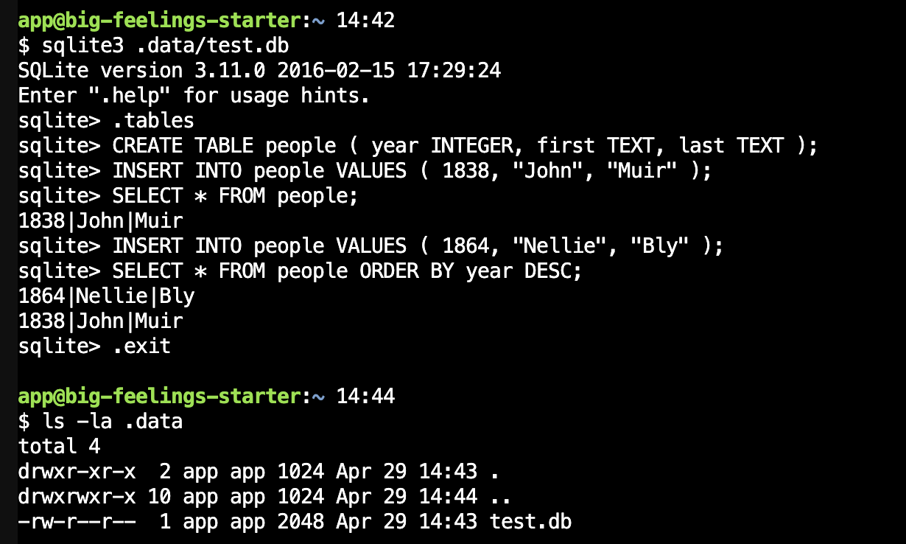

import CustomAside from '@/components/CustomAside.astro';

<CustomAside type="newmaterial">{frontmatter.description}</CustomAside>


## Create an SQLite Database

In this exercise you will use the command line and SQLite to create and insert information in a database using CRUD operations. SQLite is simple to use because it requires no special software to be installed on the server and saves the data in a single file. 

1. Remix our Big Feelings Starter https://github.com/criticalwebdesign/big-feelings-starter project. Open the Glitch Terminal and type the below and press return. This will open an SQLite session with a connection to a new SQLite database (test.db) inside a hidden folder called .data.

```bash
sqlite3 .data/test.db
```

2. Keywords with a period in front are special commands in SQLite. Type the following to see if there are any tables in the database. 

```bash
.tables
```

3. Commands without a preceding period are run as SQL queries. Run this query to add a table called people with three columns. Databases increase their storage efficiency by restricting the data type that can be stored in a column. 

```bash
CREATE TABLE people ( year INTEGER, first TEXT, last TEXT );
```

4. Insert a new row in the table using the below query. SQL requires a semicolon. If you forget and press return it will assume you are still typing the query. Simply type the semicolon and press return again.

```bash
INSERT INTO people VALUES ( 1838, "John", "Muir" );
```

5. Now you can query the database to retrieve the data. We’ll use the * symbol to select all entries from the people table.

```bash
SELECT * FROM people;
```

6. Add another row.

```bash
INSERT INTO people VALUES ( 1864, "Nellie", "Bly" );
```

7. Run the select query again but reverse sort the results by year.

```bash
SELECT * FROM people ORDER BY year DESC;
```

8. To exit the SQLite session, type the following.

```bash
.exit
```

9. List the contents of the .data directory and you will see your database file has been created. 

```bash
ls -la .data
```

<figure>


The sqlite database console results

</figure>


{/* 


The original version of this tutorial was adapted for mongo in 10-4-big-feelings.mdx 

## Use Node.js and SQLite

Using SQLite and Node.js is similar to our use of MongoDB thanks to the modules we created. 


## Production Notes

- We first tried LowDB, which looks promising. However, Glitch [is currently @ Node 16](https://help.glitch.com/hc/en-us/articles/16287495688845-What-version-of-Node-can-I-use-and-how-do-I-change-update-upgrade-it) but the [latest Lowdb](https://github.com/typicode/lowdb/releases) (7.\*) doesn't support Node 16
- Switched to Vercel + MongoDB (Atlas) after the [Glitch announcement](https://www.theverge.com/news/673457/glitch-coding-platform-shutting-down) but results have been mixed. Connections don't seem to be reliable.


*/}


## SQLite Tips

- SQLite documentation: [Connect with Node.js](https://www.sqlitetutorial.net/sqlite-nodejs/connect/), [SQLite Codecademy Cheatsheet](https://www.codecademy.com/learn/connecting-javascript-and-sql/modules/learn-node-sqlite-module/cheatsheet)
- Check a database file exists (in .data directory) `ls -la .data`
- Delete (reset) a database `rm .data/sqlite.db` 
- Dump a table `sqlite3 .data/sqlite.db "select * from People"`
- Dump a table into an html file `sqlite3 .data/sqlite.db "select * from People" > export.html`
