## Context 

Chapter 1 begins with the origins of the internet, factors in the rise of the information age, and how the various impacts of networked computers can be understood by looking at other media revolutions. Likewise, we introduce the foundational components for making websites, the command line, Git version control, and publishing a simple web page on the internet.


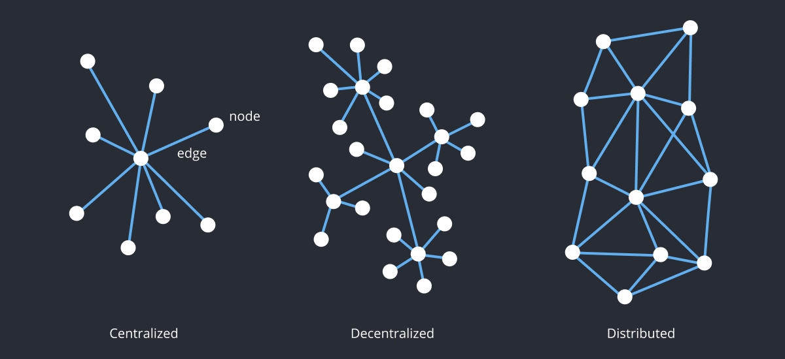
Visual representations of centralized, decentralized, and distributed networks.

 
“Arpanet 1972 Map” by UCLA and BBN

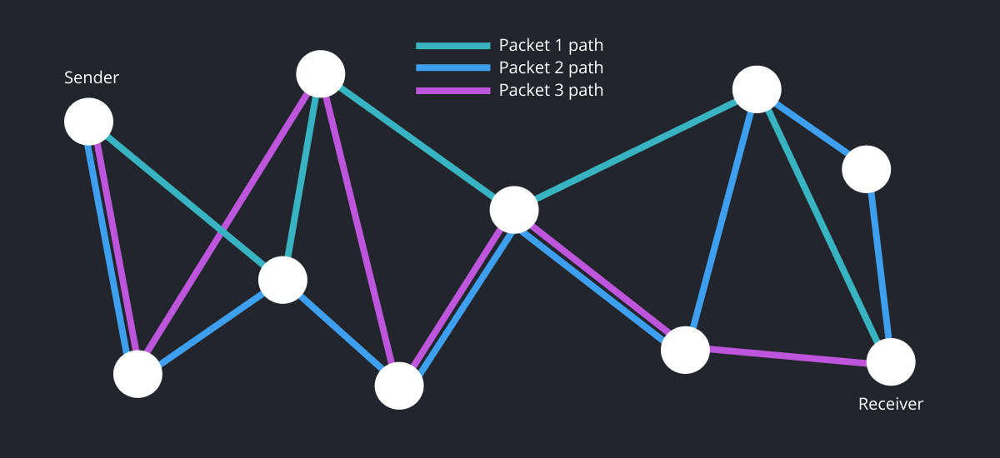 
A diagram showing how packet switching technology allows data to break apart and come together. 


You can use the website https://tools.keycdn.com/traceroute to see the path that data takes as it moves across the internet (see callout). The packet switching process occurs at each internet switch, or router (like the one in your home) to connect sub-networks to the internet. Finally, TCP/IP is the packet-switching Transmission Control Protocol (TCP) + Internet Protocol (IP). These standards are the rules that govern how computers connect to the internet.

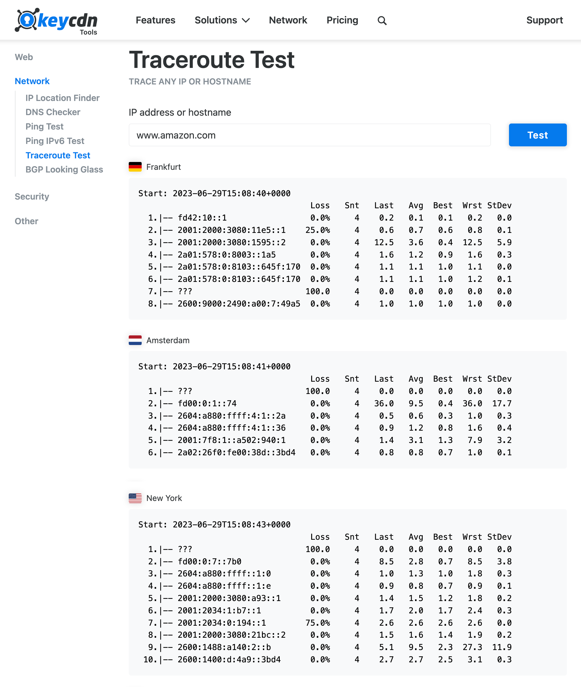 
Content Delivery Network (CDN) - The online tool at https://tools.keycdn.com/traceroute shows the paths and response time (in milliseconds) taken to retrieve data from Amazon.com, starting from different locations around the world. A Content Delivery Network (CDN) consists of several servers located around the world which each have a copy of the same data. When you visit amazon.com, the network will retrieve the web page from the server that is physically closest to speed the time it takes to load the data.


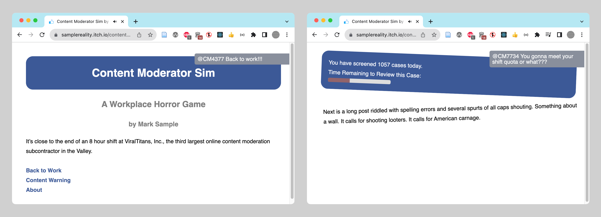 
Mark Sample, Content Moderator Sim, Version 2, August 29, 2020. https://samplereality.itch.io/content-moderator-sim 

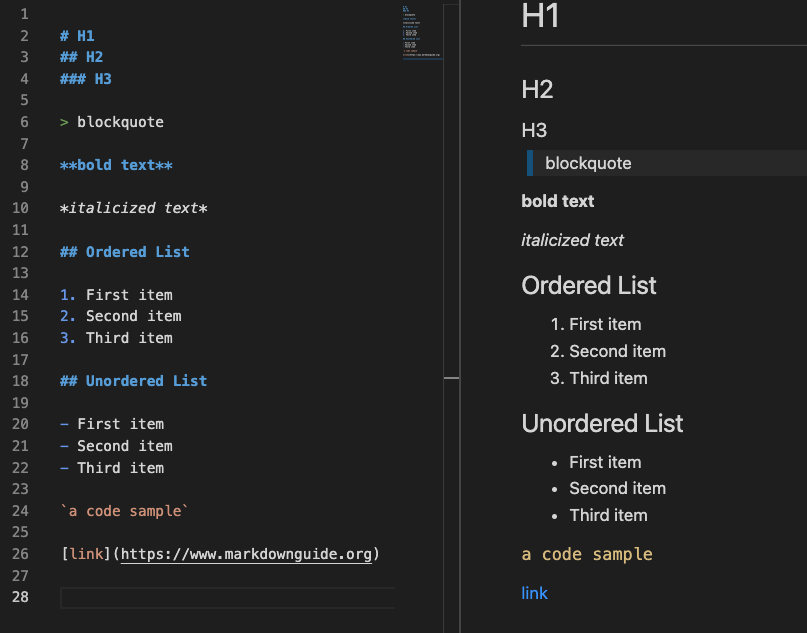 
Sample markdown code (on the left) showing basic text formatting (on the right). 

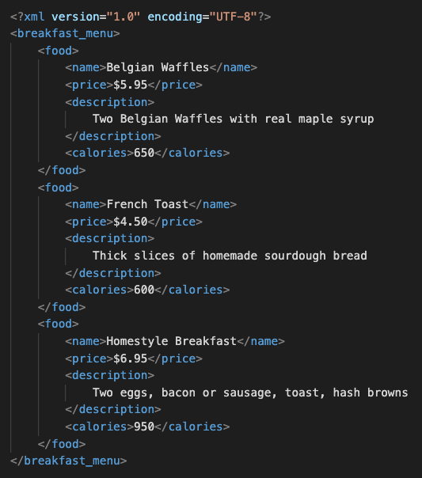 
XML (eXtensible Markup Language) is a customizable markup language. It contains no formatting, but provides access to the data it contains through its named elements and hierarchical structure. 


## 1.1 Introducing HTML 

### Markdown example

https://github.com/criticalwebdesign/book/blob/main/01-networks/examples/example.md

```markdown
# H1
## H2
### H3

> blockquote

**bold text**

*italicized text*

## Ordered List

1. First item
2. Second item
3. Third item

## Unordered List

- First item
- Second item
- Third item

`a code sample`

[link](https://www.markdownguide.org)


```


### 👉 Create a Web Page with Codepen

Code playgrounds like https://github.dev or https://codepen.io make it easy to test and share HTML, CSS, and Javascript in a “web environment.”

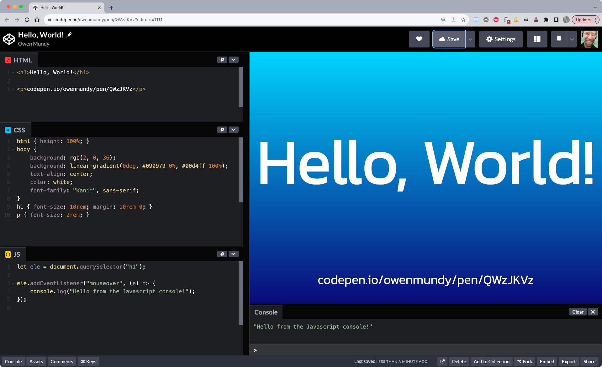
Code playgrounds like https://codepen.io make it easy to test and share HTML, CSS, and Javascript in a “web environment.”


1. In Chrome, go to https://codepen.io
1. Click “Start Coding.” You will see an area where you can type HTML, CSS, and Javascript, as well as a preview window containing the outcome of your work.
1. Type the following code into the HTML section. Codepen will automatically refresh the preview window to show your updates. HTML is the language that structures the content of web pages.

```html
<h1>Hello, World!</h1>
```

4. Type the following code into the CSS section. As you can see, CSS is the language that controls the presentation of web pages.

```css
h1 {
	color: hotpink;
}
```

5. Type the following code into the Javascript section. Javascript is the language used to control the behavior of web pages. You can see in our screenshot in Figure 0.2 you will need to click the console button to see the output from console.log().

```js
console.log("Hello, World!");
```

6. We will be using codepen.io throughout this book. Feel free to continue experimenting or look through their examples. It might also be a good idea to create a free account to save your work.

7. Explore other examples to see the range of things one can do with a code playground.
	1. https://codepen.io/owenmundy/pen/QWzJKVz
	1. https://codepen.io/sfi0zy/pen/GRwEQjd 
	1. https://codepen.io/Str3lla/pen/yLQLyzY 
	1. https://codepen.io/isladjan/pen/abdyPBw 
	1. https://codepen.io/tholman/pen/kvxQmA


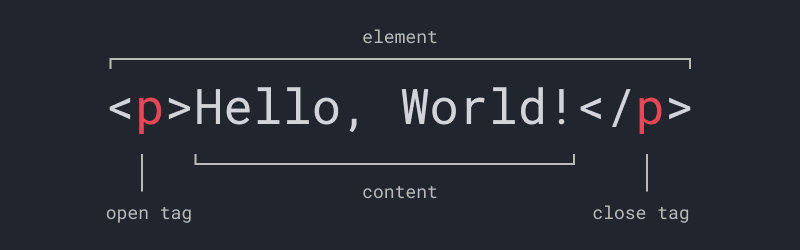 
This diagram shows the structure of an HTML element, including the opening tag, content contained within, and the closing tag. Tags use predefined names between a less than and greater than sign. 


HTML code and its corresponding text formatting when viewed with a web browser. This page is displayed using only vanilla HTML so its elements appear using the default format of the browser, as no CSS has been applied to change the presentation.


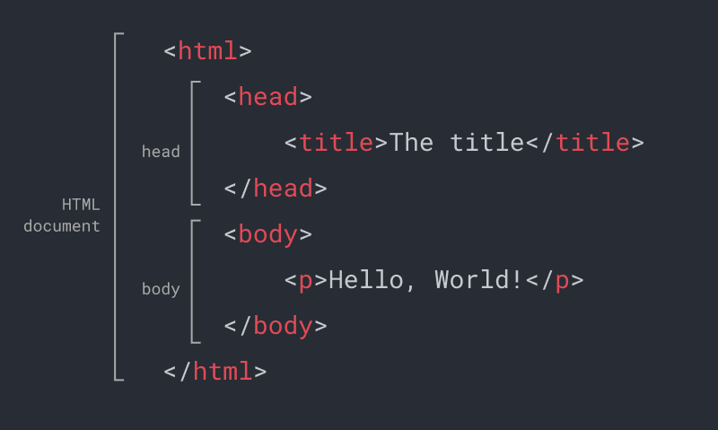 
This diagram shows the required structure of an HTML document.


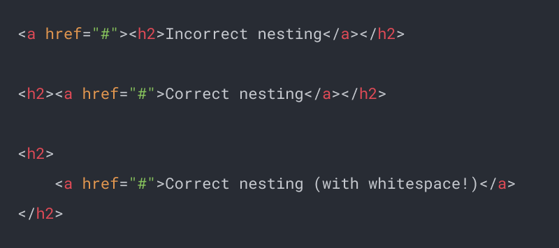
Figure 1.15 The first line shows incorrect nesting (the `<a>` tag is closed before the `<h2>`). The second line shows the proper structure. The third shows how to use whitespace with nesting to make the code readable and easier to see if there are nesting problems.


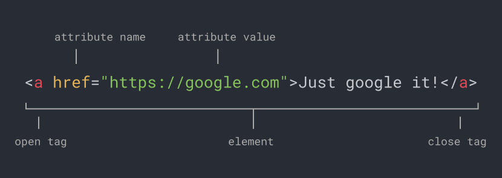
Figure 1.16 An anchor tag with an href attribute. The attribute value can be wrapped in single or double quotes.


## 1.2 Version Control


### Command Line 

If you have never used the command line before, it may appear daunting. You probably have experience with software like Microsoft Word that lets you use an interface to create, modify, and save your files to your computer. Your operating system makes this possible through a **graphical user interface (GUI)**. Using the GUI you can also create, move, or delete files on your computer by interacting with icons presented on a “desktop” by moving a computer mouse. 

The **command line** likewise allows you to explore your computer and edit files, by typing and running commands using only a text interface. Depending on the context, the command line might be referred to as a **shell**, **terminal**, or **console**. While you will spend most of your time designing for the web using a GUI, knowing how to use the command line will enable you to quickly explore files stored on your computer, troubleshoot network issues, and investigate network records. 


### Folder vs. Directory, etc.

Starting with the next exercise, you will create a folder for projects in this book and then use the command line to navigate your hard drive.

Before we begin, it is important to establish your digital work space. Throughout this book you will be editing and testing local copies of your files and then uploading them (essentially mirroring your local copy) to share them on the internet. One of the first things you should know is that a **folder** and **directory** are the same thing. When working with web servers you may see one name more than the other, but these terms are interchangeable. 

When we refer to anything **local** we are speaking about files stored on your own computer. Whereas **remote** indicates files stored on a web server and must be accessed across a network. Usually, local files are not accessible to anyone but you, while remote files are **hosted**, or **live**, and publicly accessible so that others can see them.

The files you create while completing exercises in this book will each have a specific **file path**, or address, to describe the location where they are stored on your computer. A path consists of the names of all the containing folders, separated by forward slashes, until the name of the file itself. 


### Create the Sites Folder

<!-- the more I teach different languages and tools via Github the more I realize that the default location ~/Documents/Github/ is perfectly acceptable. And, it's cross platform. We should discuss modifying this. -->

Web pages are composed of many different files, so it is essential to keep your web projects organized. Maintaining a similar folder structure also keeps your file paths consistent.  To keep your file paths organized and make it easier to follow the book, you should keep all your websites in one location that you will create on your hard drive now. 


> Author’s Note
File paths on the Web are case sensitive, so this will be the only time we ask you to create a file or folder starting with an uppercase character.

For MacOS 

1. Go to the Finder (click the picture of the blue face in your Dock).
1. From the **Finder Menu** (the top menu bar) choose File > New Finder Window. 
1. From the Finder Menu, select Go > Home. You are looking at your user **home directory**. It should include folders such as “Applications, Desktop, Documents” and more. 
1. In the Home folder, create a new folder and call it “Sites.” This will be where you save all your files as you work on exercises throughout this book.
1. Show the file path to the folder you created by choosing View > Show Path Bar (Figure 1.18). Knowing a file's path makes it easier to navigate to your files in the Finder, on the command line, and ultimately, online.


For Windows

1. Open a new File Explorer window.
1. Go to your home directory using one of the these options:
	1. Press the Windows key + R to open the Run program, type **%HOMEPATH%** and press OK.
	1. Or, at the top of the File Explorer window, click in the path bar and type **C:\Users** and press return, then double click the folder with your username.
1. You are now looking at your user home directory. 
1. In this folder, create a new folder called “Sites.” This will be where you save all your files as you work on exercises throughout this book. It's a good idea to pin this new Sites folder to your bookmarks so you can access it easily.


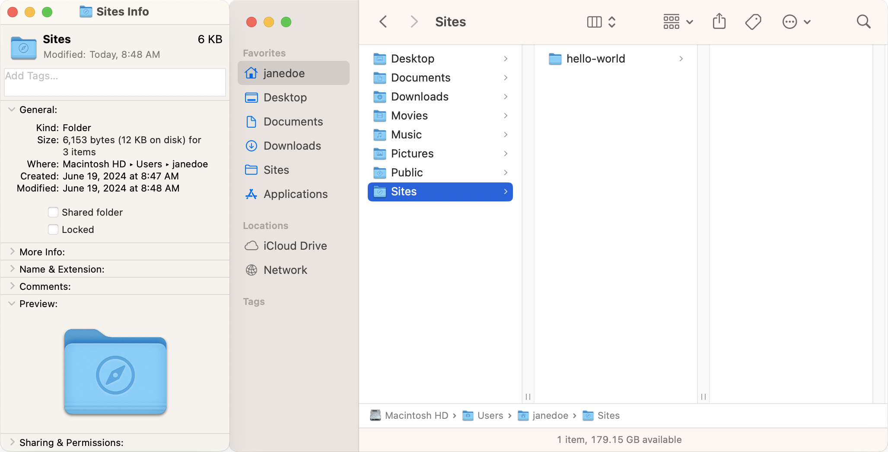 
Figure 1.17 A mac Finder window displayed as columns to see the file hierarchy. The Sites folder is created in the user’s home directory. Previous versions of MacOS included this folder, and will still display it with a special icon if you add a folder with this name. Display the path (at the bottom) by choosing View > Show Path Bar from the Finder top menu or by selecting the Sites folder and pressing Command+i to view an information window (left). 


### Install a Command Line Application

To perform basic commands you may need to install an application, depending on your operating system. Install and/or open the terminal as described below:
Mac: The Terminal application is already installed. Use Spotlight (Cmd+Space) to open.
Windows: Install and then open Git Bash [gitforwindows.org](https://gitforwindows.org) We recommend using the default settings during the installation when prompted.
Linux: [LXTerminal](https://www.raspberrypi.org/documentation/usage/terminal/) is already installed. Locate and open LXTerminal.


### Command Line Basics

With your command line application open (Terminal or Git Bash) you should see a prompt — the $ % or # symbol — which designates where you will type commands (Figure 1.19).

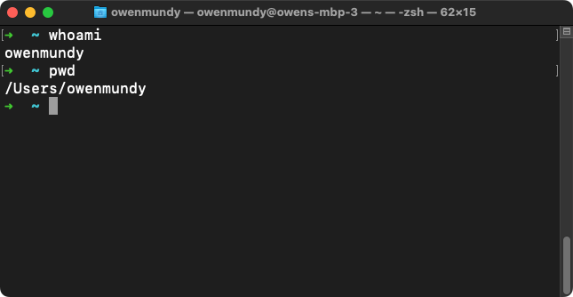 
Figure 1.19 A screenshot of the MacOS Terminal showing output from the whoami and pwd commands.


Run each of the commands in Table 1.2.1 by typing them, one at a time, at the prompt, followed by pressing the return (Enter on Windows) key. Type them in the order in which they appear. 
If you make a mistake press backspace to change your input. At any time you can use Ctl+c (the two keys at the same time) to cancel a command.

Command | Description
--- | ---
`whoami` | Display [the username of the current user](https://en.wikipedia.org/wiki/Whoami). From this point on we will use the term `<username>` to let you know to replace it with your username.
`cd ~/` | Change to your home directory. CD is short for change directory and ~/ (tilda with a forward slash) is a reference to your home directory. Use this command any time "go home".
`pwd` | Display the full path of your current folder, or [working directory](https://en.wikipedia.org/wiki/Pwd). By default your terminal should open in your home directory and (on Mac) will look like this: `/Users/<username>/`
`ls` | [List the files](https://en.wikipedia.org/wiki/Ls) in your current directory. 
`cd Sites` | Change into the new Sites directory you created above. Pro tip: press the tab key after the first few characters of a file or folder name to have the OS autocomplete the name.
`pwd` | Now that you have created these directories and changed to them, this command will show (on a Mac) the following path: `/Users/<username>/Sites`
`touch test.html` | [Create a new file](https://en.wikipedia.org/wiki/Touch_(command)) called test.html
`ls` | List files to confirm the new file was created
`echo "hello world" > test.html` | Write some text in the new file. If you want to see your changes you will have to look in the file itself. On the command line it will seem as though nothing happened!
`cat test.html` | View contents of new file (as in "[concat](https://en.wikipedia.org/wiki/Cat_(Unix))")
 | Search the web to find the command modifier to instruct the ls command to [list files with their modified date](https://en.wikipedia.org/wiki/Ls). 
 | Search the web for the command modifier that lists all files, including hidden files.


### Run Network Commands

An **IP address** is a numerical label used to identify and connect devices to the internet. Assigned by your wifi router or Internet Service Provider (ISP), it is required before your device can send data through the network. For example, if you open Chrome and search “[what is my ip](https://www.google.com/search?q=what+is+my+IP)” the result will be a number that looks like this: 24.224.66.226. 

Each IP address is unique, but not easy to remember. A **domain name** such as “Google.com” is a human-readable string of characters that points to an IP address or web host. You can use the ping command in the terminal to find the correlating IP address of any domain name. 

1. Type `ping google.com` at the prompt in our terminal window to find Google’s IP address. Like sonar in a submarine, ping returns the time it takes to receive a response from the address you enter.
1. Review your results. You can press `Ctl+c` to stop retrieving information. You might see an address like [64.233.177.104](http://64.233.177.104) or [142.250.138.102](https://142.250.138.102).  You will see additional information, too, such as how long in milliseconds it took to receive a response from the IP you requested.

While easier to recall than the numbers in an IP address, domain names must be resolved via the **Domain Name System (DNS**) to learn the IP address of the web host. When you open a website in your browser, this is what happens:

1. A user types a domain name into a web browser.
1. The browser performs a DNS query to find the IP address of the server.
1. The browser then requests website files using the server's IP.


### Network Status with the Command Line

You can find more information about a DNS entry with the following commands. Open your command line interface (Terminal, for instance) and type the following commands after the prompt. Remember to press the `return` key to run the command:


1. `whois amazon.com` - The whois command returns the name of the person on record for the domain (and therefore, IP address) you view. When you use whois to find information about an IP address associated with a company. On Windows, you may need to use this website to perform this task: https://lookup.icann.org 
1. `ping amazon.com` - The ping command tests network connectivity. It reveals additional information, as you learned in your earlier use of `ping` to find the IP address associated with Google.com.
1. `curl --head google.com` - The `curl` (Client URL) command offers a variety of functions for evaluating resources on a network. The above command will fetch the response headers, or metadata that describes the data returned from a server. This includes several properties and their corresponding values like `Content-Type` which is set to `text/html` (a web page), among other information related to the page's origin, security, and performance. Used without any modifiers (e.g. `curl google.com`) it simply displays the contents of an HTML page in the shell. 

Now that you are comfortable using the command line to explore your hard drive, domain name, and IP address, you are ready to learn about Github and connect to it from the command line, too. 


### Why use version control?

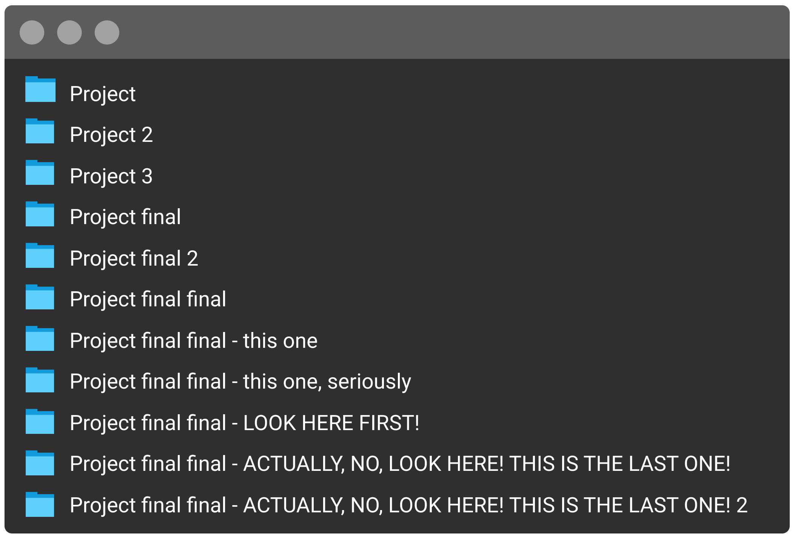 


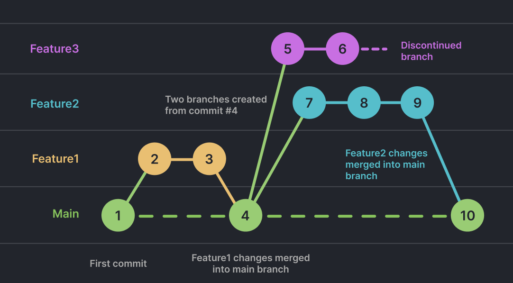 


### Git on the Command Line

Most basic Git tasks can be performed using a GUI like Github Desktop. However, performing these operations using the command line offers advanced controls in addition to making the process of creating a new repository clear.

1. Open your command line application and perform the following commands to create and initialize the project.

```bash
# Navigate to your Sites folder
cd ~/Sites

# Create a project folder and change into it
mkdir hello-website && cd hello-website

# Display your path to confirm you are in the directory directory
pwd
#-> /Users/<username>/Sites/hello-website

# Initialize Git inside this folder
git init

# Check the status to confirm git is now initialized
git status
```

2. In your Finder (or Explorer) drag the hello-website folder onto the VS Code icon in your Dock. This will open the whole project in the text editor.

3. Open index.html in VS Code. Add the following basic web page code and save your file.

```html
<html>
	<head></head>
	<body>
		Hello, World!
	</body>
</html>
```

4. Back in the command line, run the following to commit the file.

```bash
# Stage the file
git add index.html

# See that the file is now ready to commit
git status

# Create your first commit
git commit -m "First commit from the command line"

# Confirm there are no more changes
git status
```

5. In VS Code change the text inside the `<body>` tag of index.html to:

```html
<h1>Hello, World!</h1>
```

6. In command line, type `git diff` to see the modifications to this file. Those in green are additions, and red are deletions. Press `q` to exit and return to the prompt.

7. Commit the file in the command line

```bash
git commit -m "Second commit from the command line"
```

<!-- 
<div><small>The git diff command is a powerful feature that allows you to see what has changed in a file before or after you commit it to the repository.</small></div> -->


> For local development we suggest using [Visual Studio Code (VS Code)](https://visualstudio.microsoft.com/downloads/), which is free, popular, and will likely exist for many years. The list of editors we have tried includes Dreamweaver, TextWrangler, Coda, Sublime, and Atom; and we are certain that in some future moment we will use a new or different editor, too. If you are a student working with peers in a classroom, you may want to choose the same editor  so you can help each other as you are learning. Consider also that there are many benefits to trying new and unfamiliar tools, especially since adaptability and "learning to learn" is essential for developing and incorporating the changing technologies for the web.


### Install and Configure Git

There are many ways to install Git, depending on your operating system. You should first make sure you don't already have it installed. On the command line, running `git --version` will tell you the current version installed if you do. You might be prompted to install Git when you do this, which you can, or you can follow our recommended instructions.

<b>For MacOS</b>

1. Install the homebrew package manager using the install script at: https://brew.sh
1. Then run: brew install git

<b>For Windows</b>

1. Assuming you followed our instructions in the command line exercise, you installed Git when you installed Git Bash above. If not, you can download it here https://gitforwindows.org

<b>Both Mac and Windows</b>

Once installed, configure Git on the command line using the following commands, replacing the sample information with your own:

```text
git config --global user.name "Jane Doe"
git config --global user.email janedoe@example.com
```

While all Git tasks can be performed on the command line (see the tutorial in the wiki https://github.com/criticalwebdesign/book/wiki/Chapter-01), we will show you how to streamline the version control process using Github Desktop.


<!-- 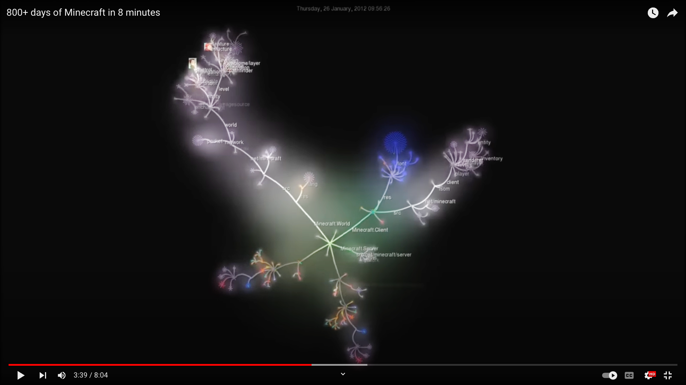
<div><small>The Gource project https://gource.io/ makes it possible to visualize the work performed in a Git repository over time. This screenshot is from a video (which you can find on their site) visualizing the history of the development of the Python language.</small></div> -->


## 1.3 Github


### Install Github Desktop

Github Desktop makes it easy to keep track and view information about your repositories, as well as list and push changes you make to your projects.

1. Download and install Github Desktop https://desktop.github.com
2. Create a Github account https://github.com/join and login to Github Desktop.


### Create a Website with Git

This exercise establishes best practices for setting up a new website project, including the index.html page, and tracking and publishing with Git. While you are working through this book, you will create a new folder and repository for the prompt in each chapter. This allows you to publish individual projects with unique URLs and keep your files organized.

1. In Github Desktop, choose File > New Repository.
1. In the dialog box that appears: Name the repository `hello-world`. The default location (`~/Documents/Github`) is fine. Check "Initialize the project with a README".
1. Click "Create Repository" This will create a new folder named hello-world inside `~/Sites` begin tracking it with Git.
1. Open the project folder in VS Code by choosing Repository > Open in Visual Studio Code
1. In VS Code, create a new file in the project and name it `index.html`
1. Add the html, head, and body elements that define the structure of an HTML file. Notice that VS Code will add the closing tags by default. Your code should look like the following:

```html
<html>
	<head>
		<title>Hello, World!</title>
	</head>
	<body>
		<h1>Hello, World!</h1>
	</body>
</html>
```

7. Save the file and preview your work in the web browser using any of these options:
    - In VS Code, right click the file and choose Open in Default Browser…
    - In Google Chrome, select File > Open File to locate the `index.html` file.
    - In the Finder, double click the file to open it in Chrome.

<!-- 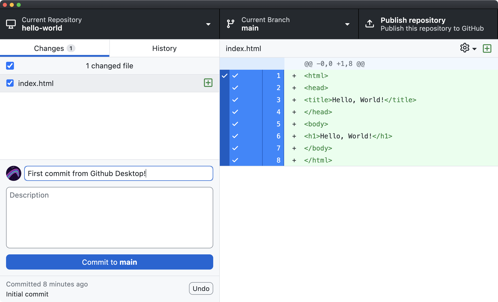
<div><small>
Github Desktop with changes to the index.html file
</small></div> -->

8. In Github Desktop, you can see the changes you've made to `index.html` highlighted in green with + signs to let you know they are additions to the file. Deletions will be highlighted in red and appear with a - sign.
9. Create your first commit by adding a commit message explaining the basics of your changes. Press commit to main and your commit will be saved in the git history. You can verify this under the History tab.

Congratulations! Not only have you created your first web page, you have also completed a basic Git workflow to edit and commit changes to a repository. In the next exercise you will post the repository on Github and set up Github Pages to publish this site to the WWW.

> <b>Pro Tip: Track Existing Projects with Github Desktop</b><br> If you already have a project on your computer you want to start tracking with git and/or publish with Github Pages you can drag the project folder into Github Desktop which will prompt you to initialize a new repository in the project (Figure 1.22).


### Publish your Repo on Github

Since you created this project on your computer's hard drive, it only exists “locally.” In this exercise you will push files in your repo to create a remote copy on github.com.

1. At the top of Github Desktop, click the button to “Publish this repository to Github”. This opens a dialogue to create a remote copy for this repo on Github.com with the same name. Deselect "keep this code private" and click Publish Repository.
1. After Github uploads your code, choose Repository > View on Github to open the remote copy. Now you are viewing your repo in the web browser, where you can see the history of commits as you did in Github Desktop. 
1. Test that your local and remote copy are synced by going to Github Desktop and choosing Fetch origin.  

> Pro Tip: Create commits in your editor 
> You can also make commits and push/pull your work to Github using VS Code. Choose View > Source Control to open and use the sidebar.


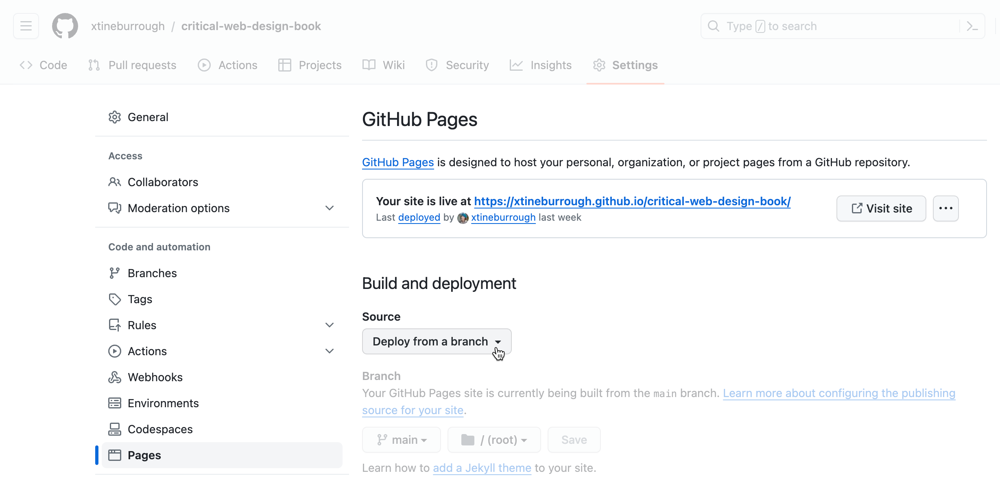


> Pro Tip: Track Existing Projects with Github Desktop
> If you already have a project on your computer you want to start tracking with Git and/or publish with Github Pages you can drag the project folder into Github Desktop which will prompt you to initialize a new repository in the project.


### Preview changes in Codespaces

Github Codespaces, like https://github.dev or https://vscode.dev/ lets you edit your project in a web browser. But Codespaces lets you see changes immediately thanks to a virtual host it runs in the background. 

1. Go to https://github.com/codespaces
2. Click **New codespace**
3. On the page that opens, **Select a Repository** from the dropdown. 
4. Leave **Branch**, **Region**, and **Machine type** and click **Create codespace**
5. A new window will open with a VS Code-like editor. It looks like github.dev but thanks to a virtual machine running in the background you can install extensions and preview your work.
6. Select the Extension button (on the left) and search for Live Server. We installed [this one](https://marketplace.visualstudio.com/items?itemName=ritwickdey.LiveServer) with 60 million installs
7. Click **Install** and **Trust Publisher**
8. Back on the Explorer tab, right click on a file you want to preview and choose **Open with Live Server** to open a preview page in a new tab.


> Verified [students](https://docs.github.com/en/education/manage-coursework-with-github-classroom/integrate-github-classroom-with-an-ide/using-github-codespaces-with-github-classroom) get free use of GitHub Codespaces, up to 180 core hours per month. 

> Note: It is also possible [to run an HTTP server](https://stackoverflow.com/a/75497415/441878) with Codespaces. 


### Install Live Server for VS Code

When you view code stored on your computer with a browser it accesses your page using a `file:///` url. This is fine for basic websites, but presents issues when you want to use data in your project (see CORS in Chapter 9) or do local accessibility testing with a browser extension. Plus, it is time consuming to push each potential fix to Github Pages and wait to retest. A local server (a.k.a. **localhost**) lets you simulate your code on a live website. You could install a server on your computer, but it's quicker to use a Live Server extension for VS Code. 

1. In VS Code, go to View > Extensions
1. Search for "Live Server" (we like [one by Ritwick Dey](https://marketplace.visualstudio.com/items?itemName=ritwickdey.LiveServer), but they all generally offer the same functionality) and then click Install.
1. Right click on any HTML page and choose Open with **Live Server**. This will open your file using a temporary local server using a localhost address (127.0.0.1 is the address that a computer uses to communicate with itself).
1. As you edit and save your file the server will detect changes and automatically refresh your page!


