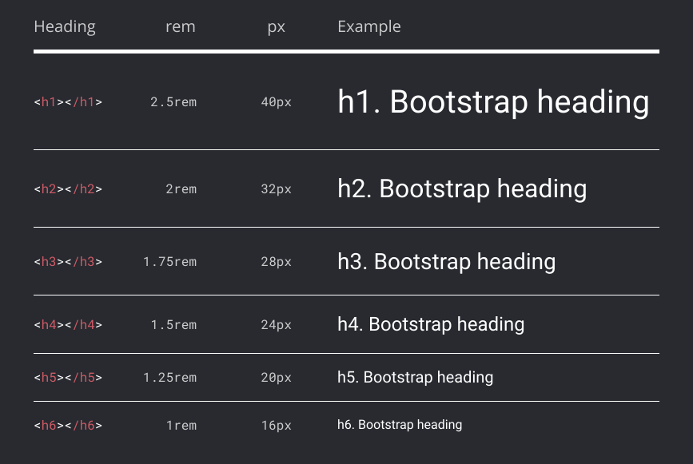
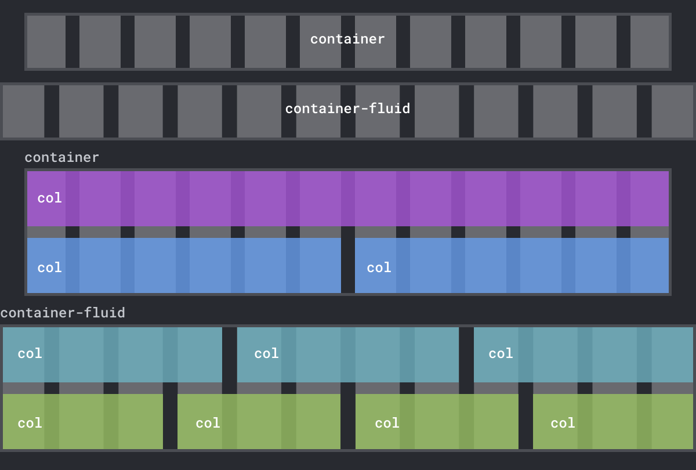
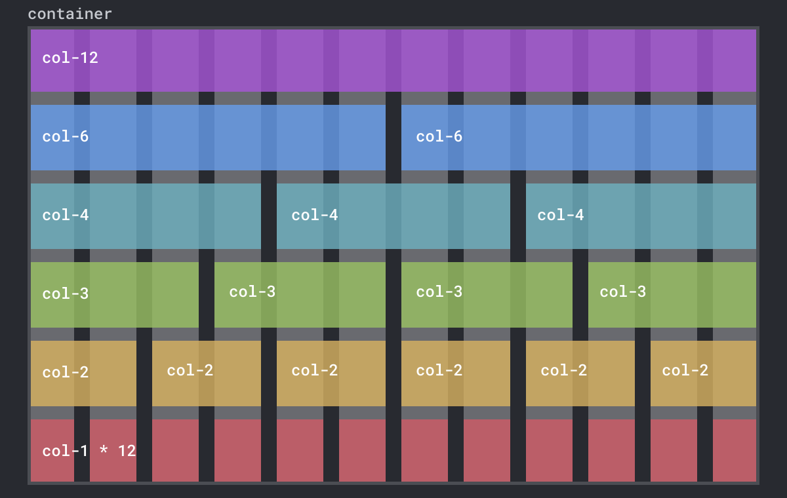
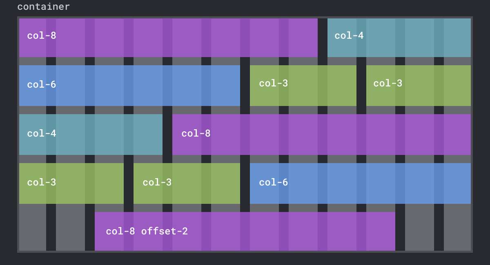

<figure>


Left aligned text has a straight edge and each line starts at the same horizontal origin. Center-aligned text has a ragged left edge and each line originates from a different location.

</figure>


## 4.2 Integrating Bootstrap


## The D.R.Y. Principle

One reason responsive CSS frameworks like Bootstrap are so widely used is that they help you adhere to a software principle called **DRY**. DRY, or “don't repeat yourself,” is aimed at reducing repetition to make writing and managing code easier. You have already been practicing DRY in this book:
- **More efficient coding** - Writing the same code over and over requires time and energy to keep consistent with previous code. You used CSS to define classes that can be reused across your site. For example, defining a typeface once for the whole site inside an html rule ensures you only need to write it once.
- **Easier maintenance** - While it makes perfect sense to copy code you've written from a previous project (e.g. to make a website responsive), what if you find a bug? Now you have to stop working on the current task to find and fix the issue in every project that uses that code. This is where Bootstrap helps, providing access to a huge amount of thoroughly-tested boilerplate code with standard features needed for every new site.
- **Avoiding errors** - Think of a program that changes a color on the page depending on user interaction. However, instead of adhering to DRY, the program updates the color from several different locations. This makes it difficult to find where the error originated. Writing code once will ensure a program does not conflict or cause unexpected behavior.
In short, when you write DRY code you will be more efficient and encounter fewer errors!


Figure 4.21 Use DevTools to inspect the CSS breakpoint and color classes that Bootstrap adds to the root element
ALT: Using the styles tab in DevTools to inspect the CSS classes that Bootstrap adds


Figure 4.2.2 Use DevTools to see Bootstrap’s btn-primary class custom properties.
ALT: Use DevTools to see Bootstrap's btn-primary class custom properties


## Exercise 4.2.3 Override Bootstrap Styles

There are generally two ways to override Bootstrap styles. The Bootstrap documentation suggestsusually shows customizations using Sass variables. As we discussed, this requires extra setup to recompile the CSS and is really more appropriate for large projects. The method we'll show below applies to the pre-compiled version we've been using so far from the CDN. You will use DevTools to identify the classes you want to override and simply add your own rules, just as you normally would with CSS.  

1. Open `on-the-grid/index.html` in Chrome. 
2. Add the following CSS rule to change the background color of all elements that use the `btn-primary` class from the default blue color to purple. The additional `!important` rule will add more importance than normal rules for that property on that element. 

```css
.btn-primary { background-color: purple !important; }
```

> **Best Practices: CSS coding** <br> Using CSS rules low in specificity will allow you to create reusable styles that are easy to override when needed. In addition to the methods we describe above, you can add `!important` to the end of a declaration to create the most specific rule of all. Update your code with this to see what we mean.
> `h1 { color: hotpink !important; } `


3. Thanks to the CSS cascade, the above method works as long as you add it *after* you incorporate the Bootstrap CSS file. But, as you can see, it doesn’t cover all the states of interaction (hover, active, focus, etc.). This is because you haven’t added rules for each of the interaction pseudo-classes. While you could do that, you would be creating repetitious code. Instead, you'll keep your code “DRY” by overriding the custom properties in the main `btn-primary` class. Start by commenting out the rule you just added, then save your work and refresh the page in Chrome.
4. As you did in the previous exercise, inspect the “primary” button and find the rule for the `btn-primary` class with the custom properties. Since your previous rule was removed it should be blue again. Copy/paste the rule from DevTools into your `<style>` element in index.html. 
5. To override the colors used by the button you simply need to update these colors. As a test, set `--bs-btn-bg` using any of the named web colors https://en.wikipedia.org/wiki/Web_colors (Figure 4.23). We assigned the color `slateblue`. Save and refresh your work. 

```css
.btn-primary {
    	--bs-btn-color: slateblue; 
}
```


Figure 4.23 The code and results from updating the background color of btn-primary.

6. This works, but you still have to enter the same color name several times because some of the color values in this rule are being reused. To avoid repetition and make the code easier to update let’s do this using the DRY principle. You’ll need to just define seven custom properties, several of which are reused across all the interaction states. Add a `:root` rule above the `.btn-primary` rule. Then type the following seven custom properties. These properties could be any name and color. We named them using a fruit followed by the name of the first time it was used in the class. The first two colors are for the text and the five following colors are variations of orange that are progressively darker to match how Bootstrap’s hover effect works on other button classes. It was easy to create these variations with the color picker tool in Visual Studio by adding the first orange color to all of them and then selecting and slightly dragging the color picker interface to find one just a tad darker in value each time (Figure 4.24). Experiment as needed.


Figure 4.24 You can select a color with a color picker tool in Visual Studio Code by clicking on the color chip next to its hex value or name in the stylesheet. 
ALT: A screenshot for the color picker tool in Visual Studio Code. 

```css
:root {
	--oranges-btn-color: #000;
	--oranges-btn-hover-color: #000;
	--oranges-btn-bg: #eeac20;
	--oranges-btn-hover-bg: #e6a61c;
	--oranges-btn-hover-border: #eaa91e;
	--oranges-btn-active-border: #ebaa1c;
	--oranges-btn-focus-shadow-rgb: 235, 170, 28;
}
```

7. Now that you’ve added these definitions you can override all the defaults for `.btn-primary` using the CSS `var()` function. Update the rule as we did below and in Figure 4.25 then save and refresh your page in Chrome. You should see the color has been updated for all of the different states of interaction, including focus, which you can check by clicking on the page and tabbing through the buttons. 

```css
.btn-primary {
    --bs-btn-color: var(--oranges-btn-color);
    --bs-btn-bg: var(--oranges-btn-bg);
    --bs-btn-border-color: var(--oranges-btn-bg);
    --bs-btn-hover-color: var(--oranges-btn-hover-color);
    --bs-btn-hover-bg: var(--oranges-btn-hover-bg);
    --bs-btn-hover-border-color: var(--oranges-btn-hover-border);
    --bs-btn-focus-shadow-rgb: var(--oranges-btn-focus-shadow-rgb);
    --bs-btn-active-color: var(--oranges-btn-hover-color);
    --bs-btn-active-bg: var(--oranges-btn-hover-border);
    --bs-btn-active-border-color: var(--oranges-btn-active-border);
    --bs-btn-active-shadow: inset 0 3px 5px rgba(0, 0, 0, 0.125);
    --bs-btn-disabled-color: var(--oranges-btn-hover-color);
    --bs-btn-disabled-bg: var(--oranges-btn-bg);
    --bs-btn-disabled-border-color: var(--oranges-btn-bg);
}
```


Figure 4.2.5 This screenshot shows our custom properties in DevTools.
ALT: A screenshot of DevTools with custom properties in place.


> **⚠️Watch Out! Bootstrap Themes** <br> A **theme** is a collection of coded files that modify the appearance or behaviors of an interface. Themes can be installed in code editors, Wordpress websites, and even Bootstrap. For example, we have been using the one-dark theme in the graphics for the book as an homage to the Atom (R.I.P.) editor we used before VS Code. Bootstrap 5.3 has something like a theme in their in-progress color modes feature to let you select between light (default) or dark modes. 
> Color mode differs from the themes widely available online that vary in quality, support, and price. It goes without saying that *practicing design* yourself is the most important path toward becoming a designer. But we also recommend you avoid using "bootstrap themes" for now so you learn the foundational concepts we present and avoid getting stuck. While third-party themes appear to be fast solutions, they usually create more work due to little documentation or support. And, perhaps more importantly, they lock you into choices someone else is making. In *The Language of New Media* Lev Manovich describes this problem well, stating that the “interface shapes how the computer user conceives the computer itself.” In other words, the tools you use ultimately affect the choices you are able to make due to the limits imposed by their creators.



Figure 4.26 The headings in the Bootstrap framework scale at consistent values.
ALT: An image showing the headings in the Bootstrap framework. 


## 4.3 The Bootstrap Grid System

Bootstrap demo https://codepen.io/owenmundy/pen/oNLZpWM


Figure 4.27 [Coolors.co](https://coolors.co/) export options and CSS formats.
ALT: Coolors.co export options and CSS formats



Figure 4.28 Bootstrap's container-fluid class always expands to the full width of the window, while the container class has a maximum width. The .col class will expand to fill the width of the row on that container.
ALT: Diagram showing the container and container-fluid classes.



Figure 4.29 A design with Bootstrap grid system showing one, two, three, four, six, or twelve equally-sized columns per row. 
ALT: A design with Bootstrap grid system showing one, two, three, four, six, or twelve equally-sized columns per row.



Figure 4.30 You can mix and match Bootstrap column sizes however you like, including the offset set class which can center the columns in a container. The only rule is that the column and offset spans together add up to 12. 


Figure 4.31 The Emmet package in VS Code lets you type the beginning of an HTML element and press tab to add the open and close tag you want. This feature also lets you add HTML elements with their class names by typing the full name of the selector.
ALT A screenshot showing code autocompletion in VS Code.


Figure 4.32 Your code should contain five divisions in total, as well as headers and an image. 
ALT A screenshot showing code completed so far.


Figure 4.33 The image in the second column is not scaling or reflowing like the text.
ALT A screenshot of the image in the second column.


Figure 4.34 Notice the difference in negative space before and after we added top margin to the heading.
ALT A screenshot showing before and after adding spacing above the heading


Figure 4.35 Our final composition https://criticalwebdesign.github.io/book/04-on-the-grid/examples/the-new-york-felines/module4.3-finish.html for multiple breakpoints seen in the browser with DevTools. The Toggle Device Toolbar (see the cursor in the upper right corner of the top image) enables you to view your work across multiple devices in the Chrome browser.


## UX Design

- https://www.figma.com/resource-library/design-basics/
- https://uxtools.co/challenges/
- https://help.figma.com/hc/en-us
- [Figma template](https://www.figma.com/community/file/1248375255495415511) for [Apple Design Resources for iOS 17 and iPadOS 17](https://developer.apple.com/design/resources/)


## Bootstrap

- https://getbootstrap.com/
- https://www.w3schools.com/bootstrap5/index.php
- https://getbootstrap.com/docs/5.3/customize/sass/#color-contrast


