## Context 

In Chapter 5 we introduce foundational design principles for usability, including focus, contrast and negative space. We demonstrate how to create a usability test for a website, deliver the test, and reflect on the outcomes. The prompt for this chapter has students create their own usability test using professional standards and methods, implement this test with a friend or colleague, and design and code a responsive webpage containing their reflections on the outcomes with recommendations for the site owner.

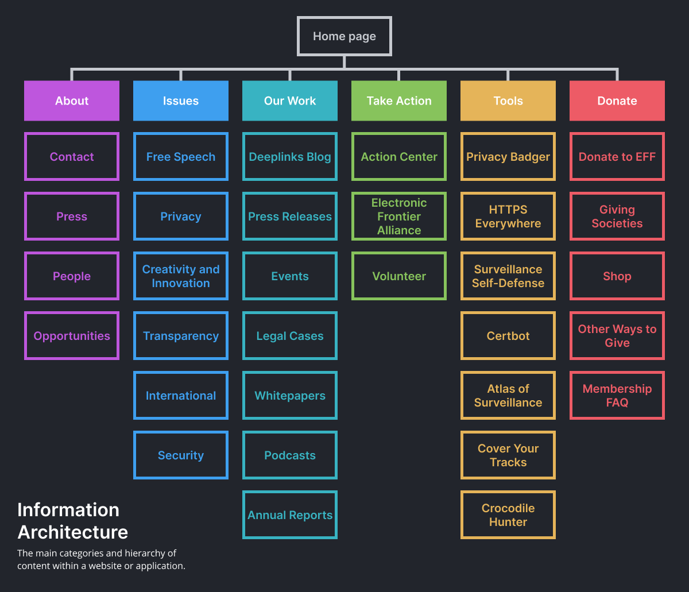
Figure 5.1 Example information architecture from the Electronic Freedom Foundation (EFF) website http://eff.org, a nonprofit organization defending civil liberties in the digital world.
ALT: The information architecture from the EFF website

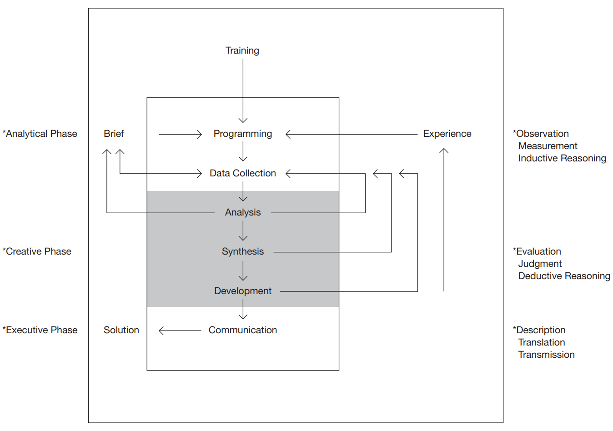
Figure 5.2 Basic design procedure by Bruce Archer, recreated by Hugh Dubberly in his book, How do you design? A Compendium of Models (2005).
ALT: Basic design procedure after Bruce Archer

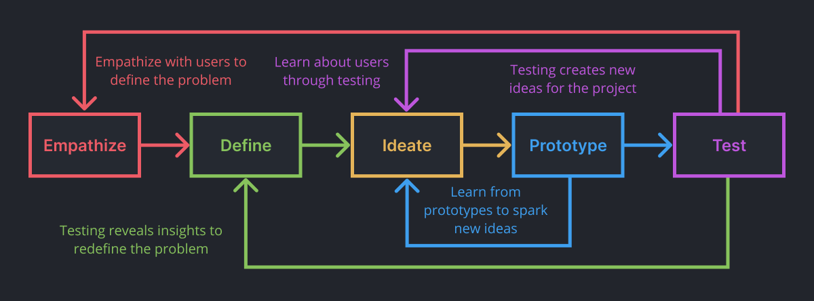
Figure 5.3 The common stages of a design thinking process are represented most often as a series of iterative loops that inform each other to improve your outcomes.
ALT: Diagram to express common stages of design thinking.

Figure 5.4 A competition scan showing how different mountain bike manufacturers have all solved the same design problem in different ways. Each company has to communicate bikes by intended terrain, wheel size, frame material, suspension, weight, etc. using menus, filters, images, quizzes, information hierarchy, and other methods for all the different bikes on their sites.
ALT A competition scan showing bike manufacturers' solutions for showing different types of bikes.

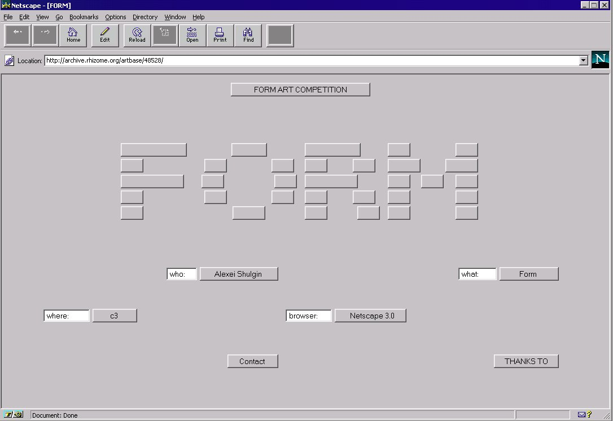
Figure 5.5 Alexei Shulgin, Form Art, 1997 (https://www.c3.hu/collection/form) presents various functioning form elements, including inputs, radio buttons, and checkboxes. When clicked, scrolled, or checked, the elements animate, provide context, or link to new pages in a continuous narrative of virtual paperwork. You can interact with the project here https://sites.rhizome.org/anthology/form-art.html as it was originally published using a browser emulator. 
ALT Screenshot from Alexei Shulgin’s Form Art  

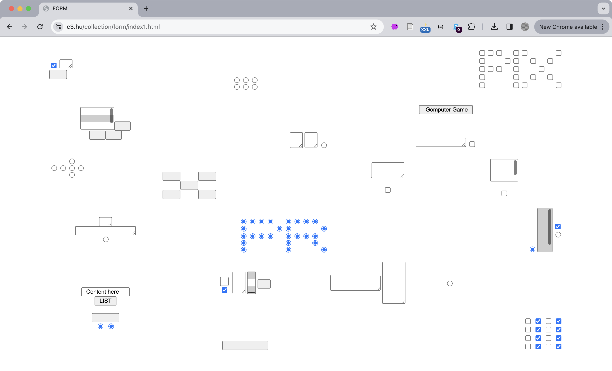
Figure 5.6 Alexei Shulgin, Form Art, 1997 (https://www.c3.hu/collection/form/index1.html) as seen today. You can also view a list of the project's content https://www.c3.hu/collection/form/list.html to provide order to your experience.

## 5.1 Usability Testing

Figure 5.7 Artists and designers create wireframes for site architecture.
ALT 5.7 A large sheet of white paper contains many square post-it notes in red, yellow, and blue to define different parts of a website’s architecture.

## 5.2 Javascript Data Types

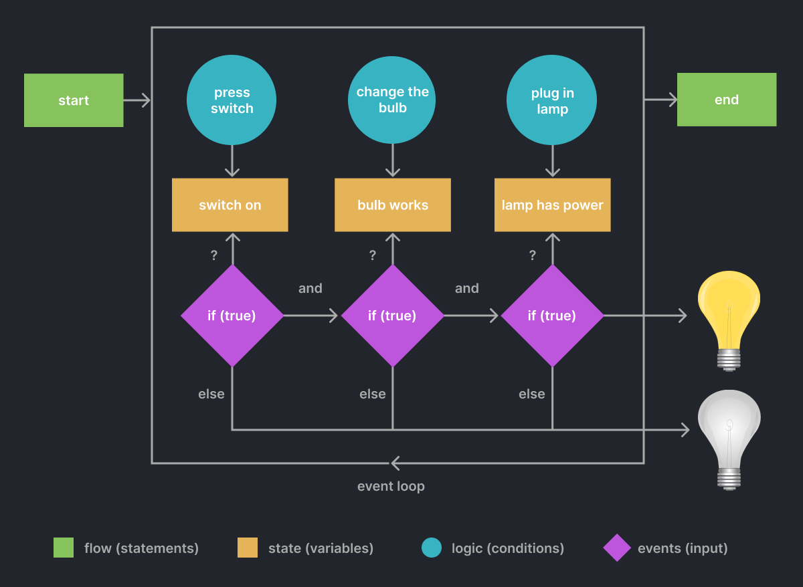
Figure 5.8 This graphic shows the flow, state, logic, and events of a program that “turns a lamp on or off.” The logic (decisions the computer makes) is based on the state (the status of variables in the program) and events (e.g. user input) directing the computer towards its goal.
ALT: This graphic shows the flow, state, logic, and events of a program that turns a lamp on or off.

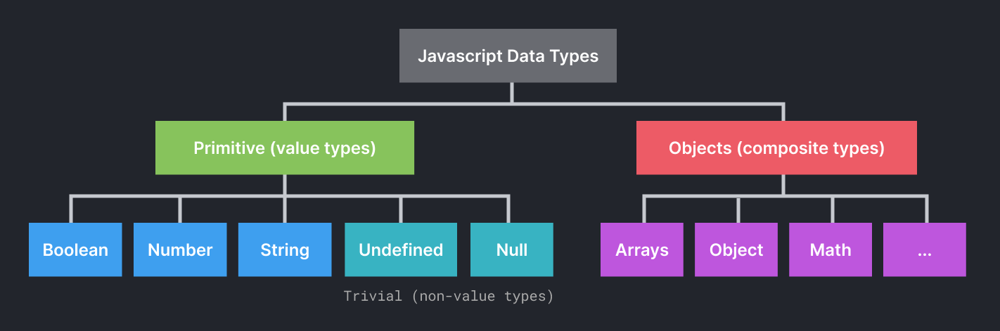
Figure 5.9 Javascript organizes data by primitive and non-primitive types
ALT: A diagram showing how Javascript organizes data by primitive and non-primitive types.

## 5.3 Javascript & Web Forms 

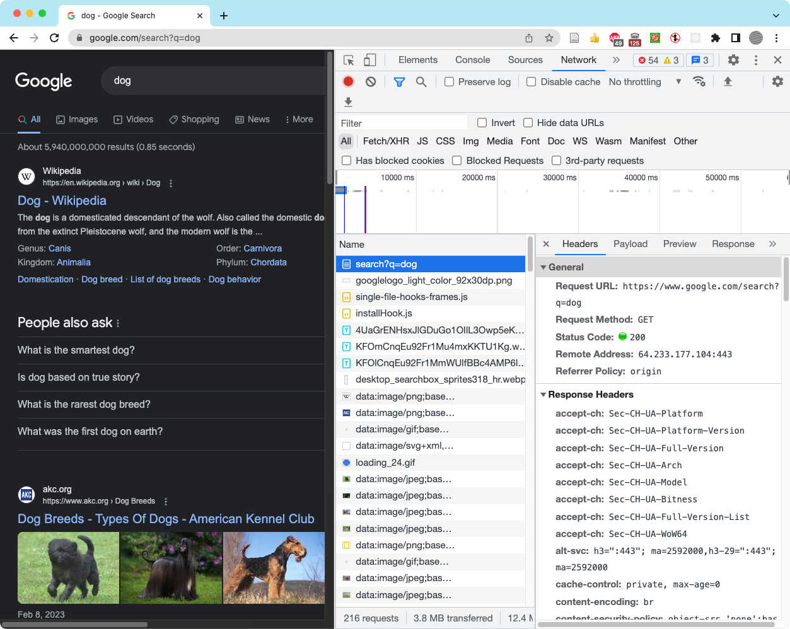
Figure 5.10 Inspecting the headers of the GET request using a Google search for “dog.”
ALT A screenshot showing how to inspect the headers of the GET request using a Google search for “dog”

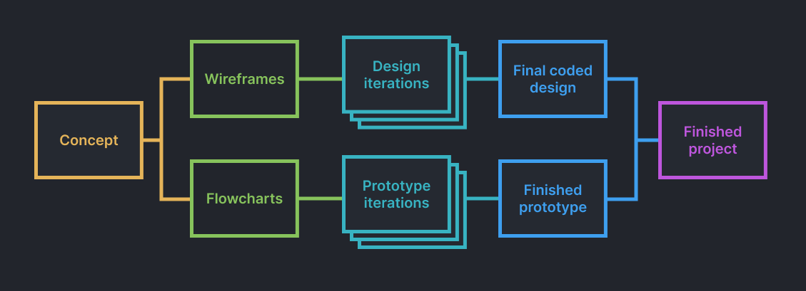
Figure 5.11 It is a good practice to create design and prototype iterations separately before merging them together, as we show in this "iterative design/prototype flowchart". This makes it easier to create and edit designs in Figma that echo and imagine the work you do in your prototype. Equally, keeping the prototype free of design code will simplify your testing and iterations. After multiple iterations you can bring them together into the final coded version of your project. 
ALT Diagram separating design and coding processes during iteration.

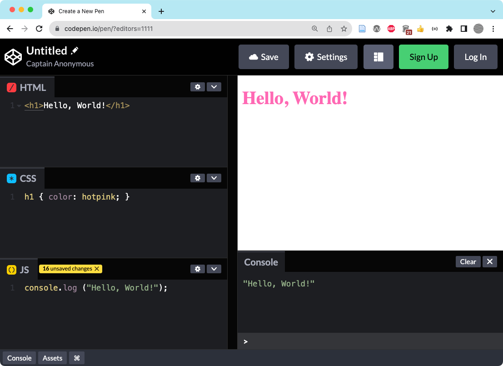
Figure 5.12 We added HTML, CSS, and Javascript to a new codepen.
ALT: Screenshot of codepen with added HTML, CSS, and Javascript.

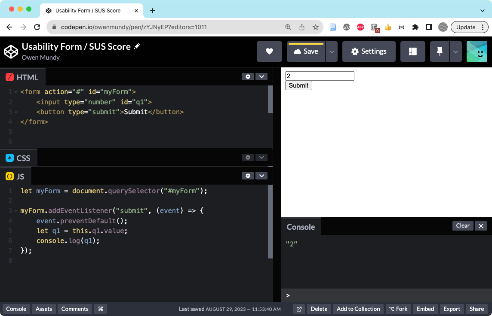
Figure 5.13 Set up the HTML and JS code to create a form in Codepen.io.
ALT: Screenshot of Codepen.io with HTML and JS from Exercise 5.3.2.

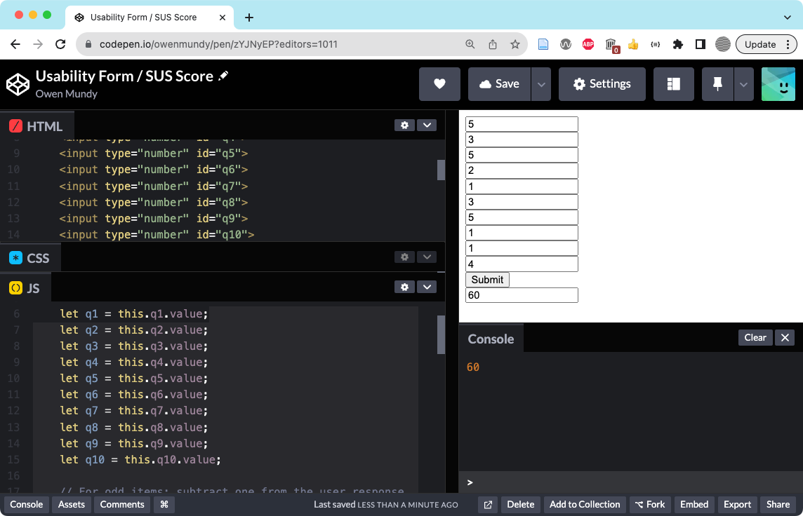
Figure 5.14 The finished SUS form prototype https://codepen.io/owenmundy/pen/zYJNyEP
ALT: The finished SUS form prototype.

Figure 5.15 An example of form validation thanks to the required attribute.
ALT A screenshot showing an example of form validation thanks to the required attribute.

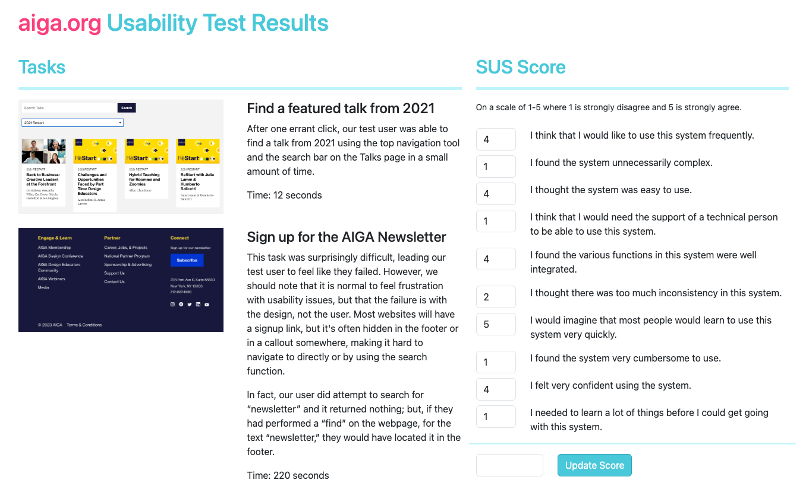
Figure 5.16 The results of our usability test, coded in a web page with the SUS form can be found at https://criticalwebdesign.github.io/book/05-usability/examples/usability-aiga/module5.3-finish.html

## Inspiration

Ksenia Kondrashova [Rube Goldberg HTML form](https://codepen.io/ksenia-k/pen/xxoqXbJ)

