## Context 

Chapter 10 discusses the power designers have to evoke participation and collective experiences. The modules show readers how to use tools to create a participatory experience combining interactive maps with a database. 


### Optimism


10.1 The first prototype of the solar powered server that runs the Low-tech Magazine website. The solar charge controller (on the right) is powering the server (on the left). This image, like others on the site, is dithered to reduce the file size and make the server more efficient.


- Tactical Tech https://tacticaltech.org is an organization that uses design and research to promote digital literacy through apps, experiences, interventions, and educational resources. Their Data Detox Kit https://datadetoxkit.org can help “take control of your digital privacy, security, and wellbeing,” along with other practical outcomes. 
- Games for Change https://gamesforchange.org is a festival dedicated to empowering diverse voices and innovation around social issues through games. 
- The Markup https://themarkup.org creates journalism and web applications that challenge technology to serve the public good. One of our favorites, their Blacklight tool https://themarkup.org/series/blacklight is a real-time website privacy inspector that exposes tracking technologies like, well, a blacklight. 
- Low-tech Magazine https://lowtechmagazine.com is an online publication that questions the value of technological progress, describes the potentials of often forgotten tech, and promotes sustainable energy practices. Unlike the mind-numbing megawatts required for server farms and data centers used by Amazon, Instagram, and TikTok, Low-tech focused on efficiency in their design by removing advertising and using a static site generator (Hugo) to [power their website with a single 50W solar panel](https://solar.lowtechmagazine.com/2018/09/how-to-build-a-low-tech-website/). 


Other groups who encourage technology companies to consider the public good over profit:

- https://www.humanetech.com
- https://accountabletech.org
- https://cltc.berkeley.edu/
- https://cyber.harvard.edu/
- https://lowtechmagazine.com/


### Participation

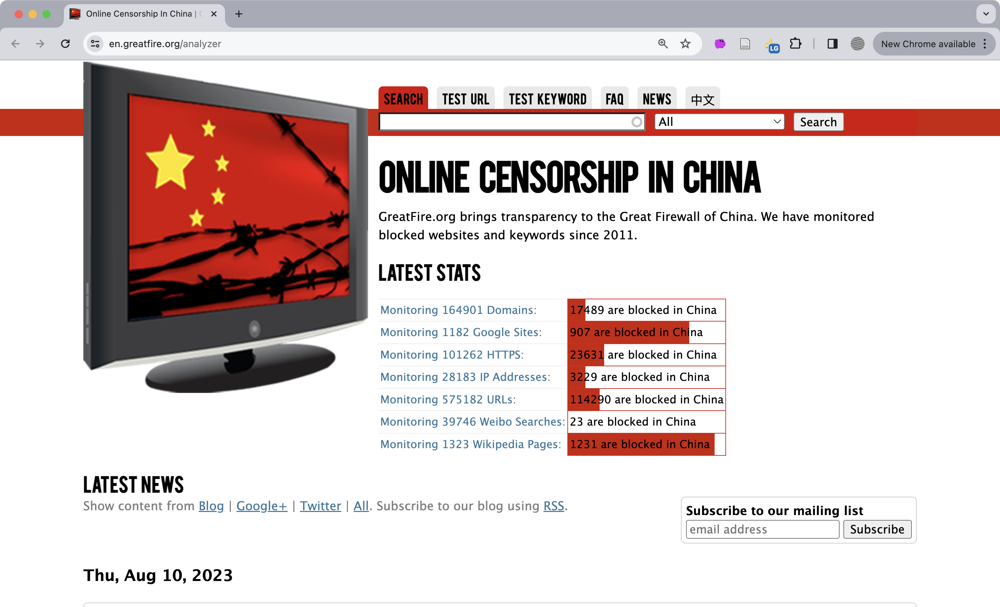
The https://en.greatfire.org/analyzer shows which domains and keywords are blocked from within the "Great Firewall of China." Enter a website address and watch as the site attempts to access it from servers located within the People's Republic of China, to display a real-time report on the country's elaborate censorship network. The latest statistics about the number of blocked services (17,489 domains!) are saved to their database and displayed on the front page for the world to see. 

Examples that involve crowdsourced information, user contributions, or other shared experiences.

- GreatFire.org is a site that brings “transparency to the Great Firewall of China.” Their GreatFire Analyzer tool https://en.greatfire.org/analyzer makes visible and provides crowdsourced reports on the Network-making Power (Castells) enacted by the Chinese government in the form of censorship, domain blocking, and deep packet inspection (Figure 10.2). 
- Brooke Singer and her team created https://www.toxicsites.us to collect and reconfigure publicly-available data into a more usable interface "to engage people in public information and encourage participation". 
- Terms of Service; Didn’t Read https://tosdr.org grades websites and services on how well they respect users in their Terms of Service. The site contains a wealth of user-contributed stats on Facebook, Amazon, and others' non-obvious power grabs enabled in the agreements everyone accepts, but rarely reads.
1


### Shared Experiences

- Projects like Pip Shea's [Any Cast](https://dev.themaninblue.com/anycast/) transform a mundane activity (like agreeing to Terms of Use for free wifi) into a collectively-generated stream of thoughts to create a whole truly greater than the sum of its parts. A similar project (without wifi, but still online today) is Alex Fuller's http://www.onamountaintop.com which equally allows anyone to share a simple message outside of their bubble and without signing away one's privacy. 
- Dries Depoorter offers another humorous take on shared experience with Die With Me, a networked chat app that connects people around the world who have less than 5% battery left on their phones. 
Speedshow.net was created by Aram Bartoll as a reusable model to transform Internet cafés into one-night internet art exhibitions that others can extend or expand at any location.


### Participatory Service


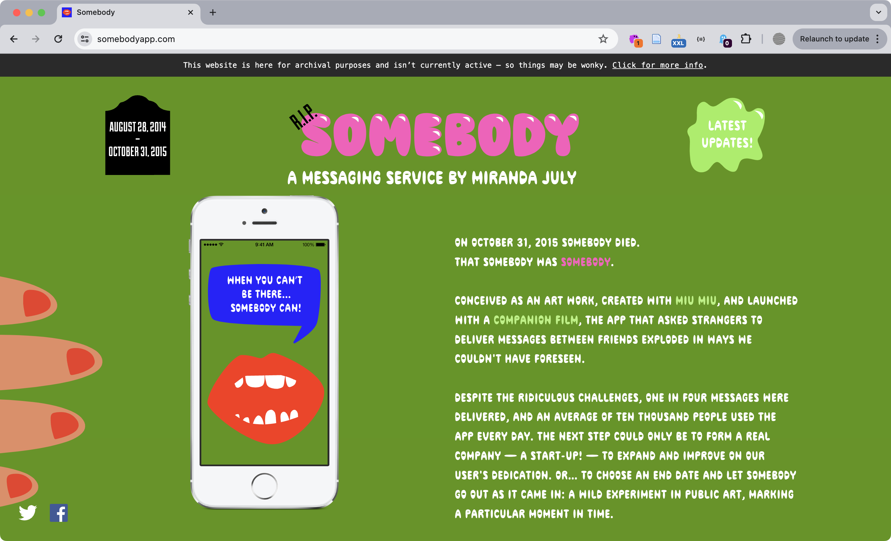
Figure 10.2 https://somebodyapp.com/ by Miranda July was a short lived but imaginative reconfiguration of critical engagement and interpersonal communication. 


- Miranda July created Somebody https://somebodyapp.com, an app and messaging service that was, in her words, “half-app, half-human.” The app connected participants in similar geographic areas, letting them send messages, or deliver them for others in person, as a social service (Figure 10.3). The companion film she created offers the best description, representing the app like a cross between Uber and Craigslist, where a stranger (or you) can transmit a message (an apology, an endearment, a breakup) in person that might be difficult to do yourself. 
- The Nicest Place https://thenicestplace.net offers hugs from its participants for a mediated audience. Informed by conceptual art practices, the website provides instructions so others can join and make an impactful experience out of a collection of small acts.
- We Feel Fine (2005) http://wefeelfine.org created by Jonathan Harris and Sepandar Kamvar was an online project that visualized publicly-available text (blogs, social media, etc.) that started with the phrase “I feel …”


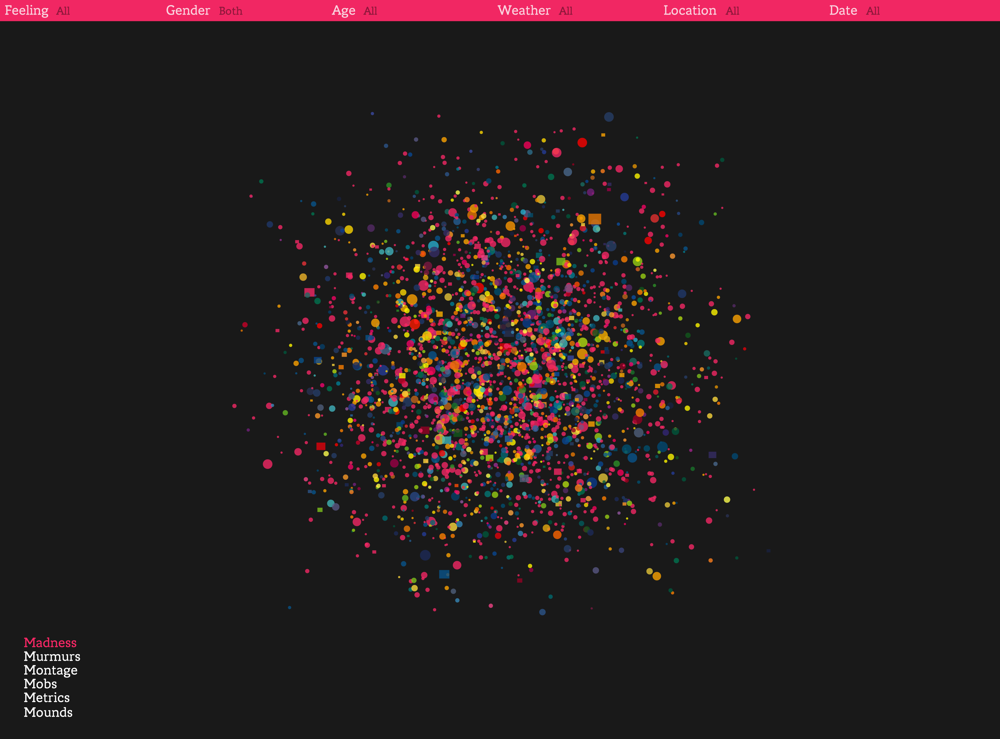
Figure 10.3 Jonathan Harris and Sep Kamvar, We Feel Fine, “Madness,” http://wefeelfine.org. 

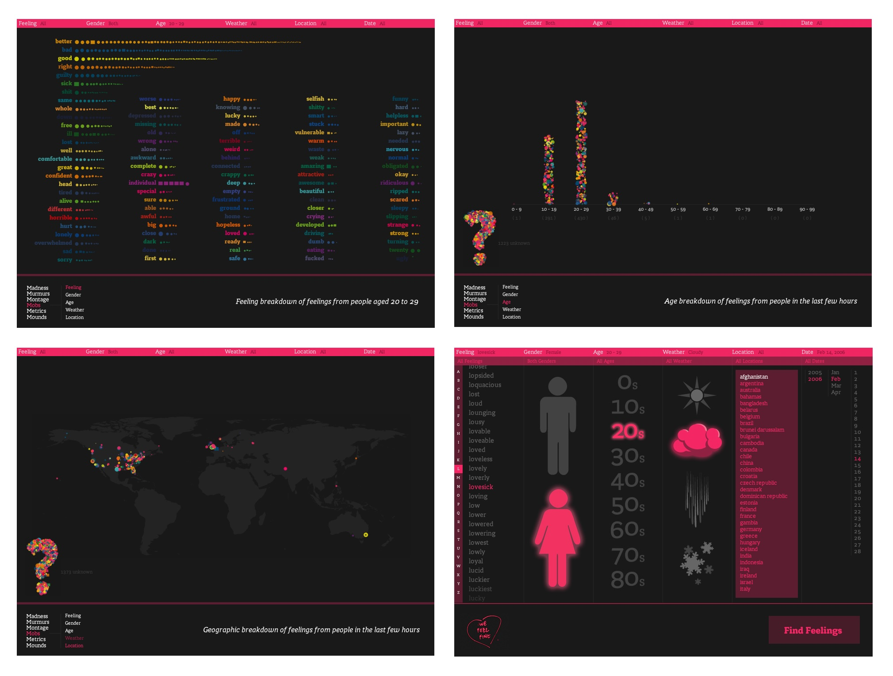
Jonathan Harris and Sep Kamvar, We Feel Fine, “Movements,” “Mobs (Age),” “Mobs,” and "Search Panel,” http://wefeelfine.org. 

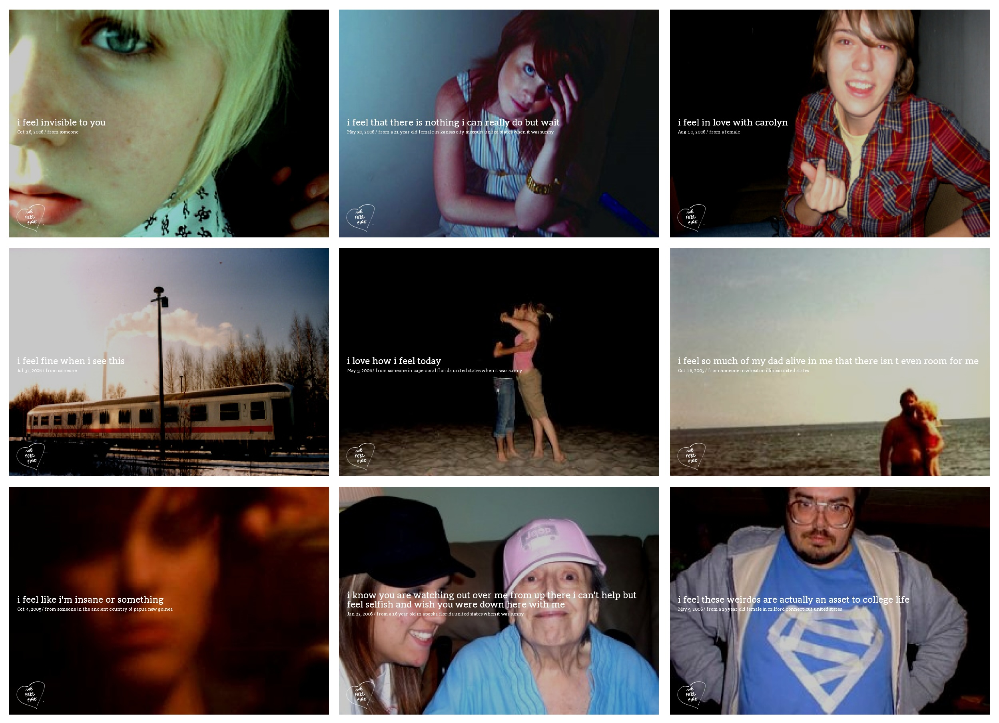
Jonathan Harris and Sep Kamvar, We Feel Fine, “Madness,” http://wefeelfine.org. 

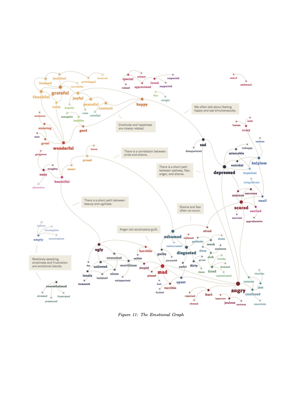
Jonathan Harris and Sep Kamvar, We Feel Fine, “Emotional Graph,” http://wefeelfine.org. 


## 10.1 Planning and Design


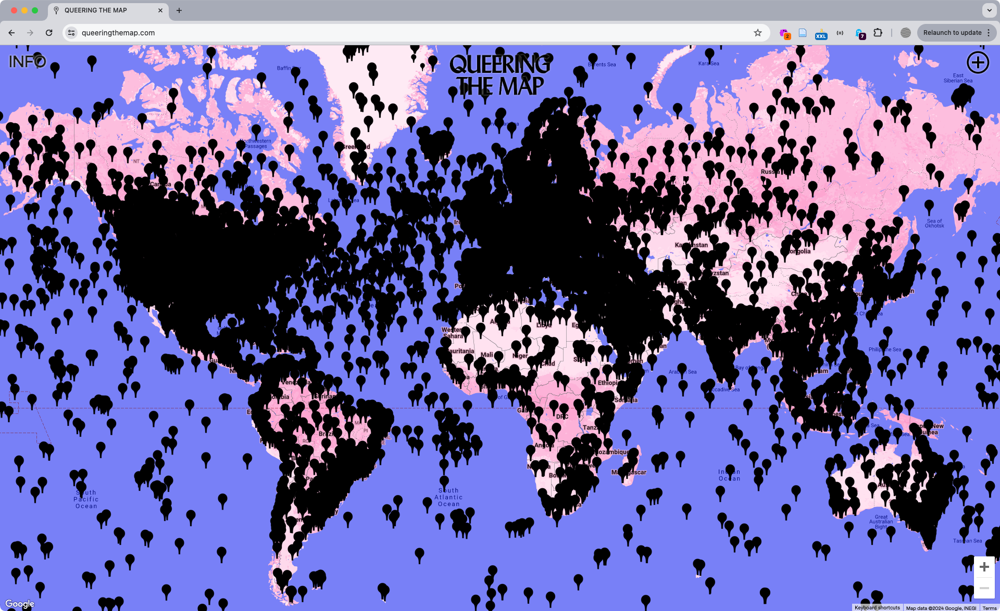
Figure 10.855 Queering the Map https://queeringthemap.com (2018) is a community-generated cartographic archive of queer experiences. Created by Lucas LaRochelle, the site catalogs, preserves, and locates the experiences of queer life, including encounters, collective action, and stories of coming out.

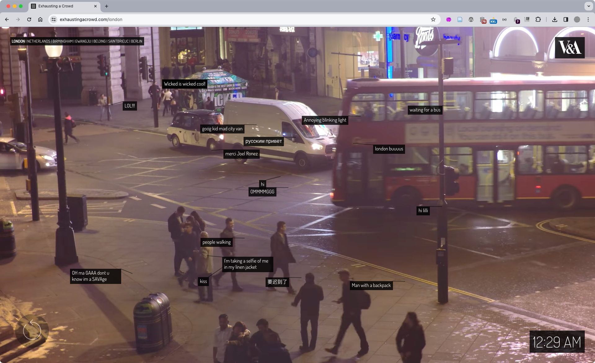
Figure 10.5 Exhausting a Crowd (2015) https://exhaustingacrowd.com by Kyle McDonald is a web application that depicts detailed security camera footage upon which website visitors can add annotations synced with both the imagery and the time code of the video. The crowdsourced text laid over the 12 hours of repeating footage from various sites offers curious commentary which perfectly balances the opposing forces of surveillance vs privacy, looking vs being seen, and control vs pleasure that defines our information culture and public spaces.


Figure 10.5 https://pointerpointer.com/ (2012) by Studio Moniker and Studio Puckey matches your mouse position to significant locations using a database of images. 


## Map Inspiration

- Jodi https://geogoo.net/
- Brooke Singer [toxicsites.us](https://toxicsites.us) 
- Lucas LaRochelle https://queeringthemap.com
- Kyle McDonald https://exhaustingacrowd.com
- Native Land Digital https://native-land.ca/
- Yehwan Song [And it's pouring in Korea](https://www.instagram.com/p/CDwHr6nBb5S/), [Rainbow behind clouds](https://www.instagram.com/p/B4ca3lThEvQ/)
- James Bridle [Dronestagram](https://www.instagram.com/dronestagram/?hl=en)
- https://www.geokitten.com
- Josh Begley [Metadata+](https://joshbegley.com/metadata/)
- Owen Mundy https://iknowwhereyourcatlives.com/


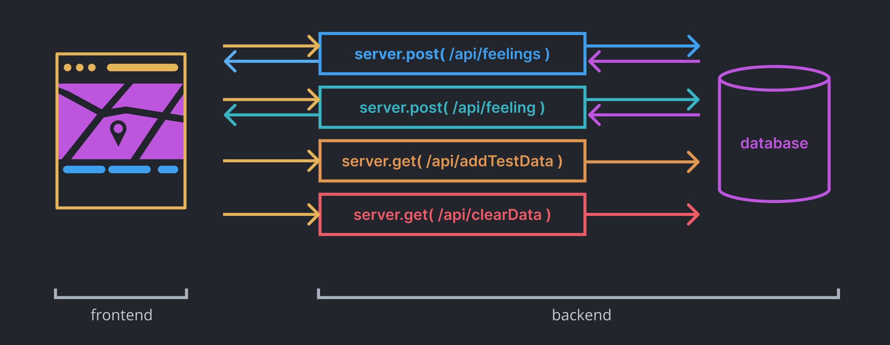
Figure 10.11 A diagram showing the relationship between client, server, and database for Big Feelings.


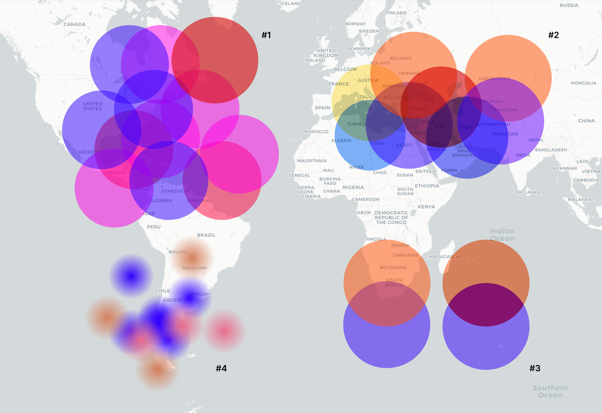
Figure 10.6 In our initial conversations about Big Feelings we imagined feelings as colorful bubbles on the map, and we wanted our map to feel mushy, like a bunch of big feelings indefinitely overlapping each other. We experimented with color (1), size (2), opacity and blending modes (3), and gradients (4), of the shapes on top of a map screenshot. 


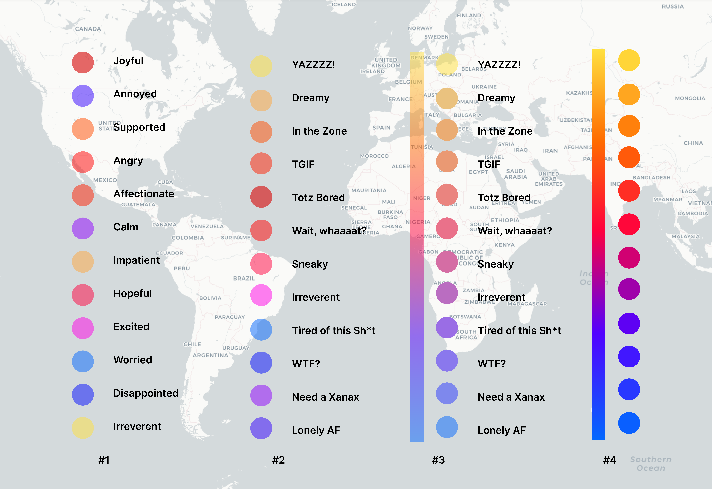
Figure 10.6 Once we knew we wanted to represent a list of feelings with associated colors we iterated on what those options would be and placed colored shapes on top of each other with various opacity levels and soft edges. We used common sentiments and selected colors by hand (1). xtine created a new, more contemporary version of the mood language (2). Owen used a gradient in Figma within a mask of circles to create a continuous gradient that spaced-out the color hues (3,4). 


A few of the mockups for Big Feelings. As you can see, an iterative process helped us to improve and test different layouts.


## 10.2 Interactive Maps


### Map Resources

- https://leafletjs.com/
- https://geojson.io
- https://jsonlint.com/

### Map Tileset Providers

- https://omundy.github.io/free-tiles/
- http://mc.bbbike.org/mc/
- https://wiki.openstreetmap.org/wiki/Raster_tile_providers
- https://leaflet-extras.github.io/leaflet-providers/preview/
- https://maps.stamen.com/
- https://www.thunderforest.com/maps/
- https://www.mapbox.com/gallery


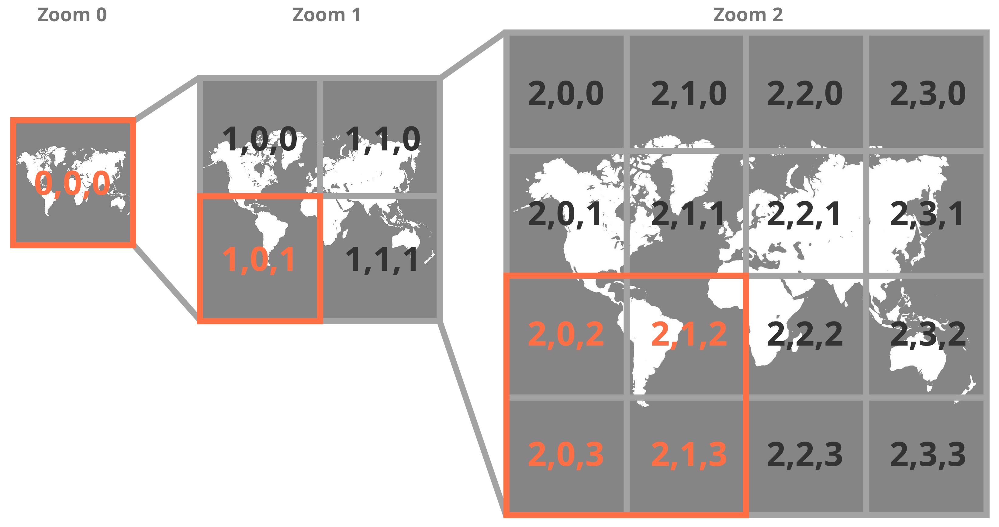
Figure 10.7 Three zoom levels in a map tileset. The labels in our graphic follow the z (zoom), x (longitude position), and y (latitude position) format of tileset templates.


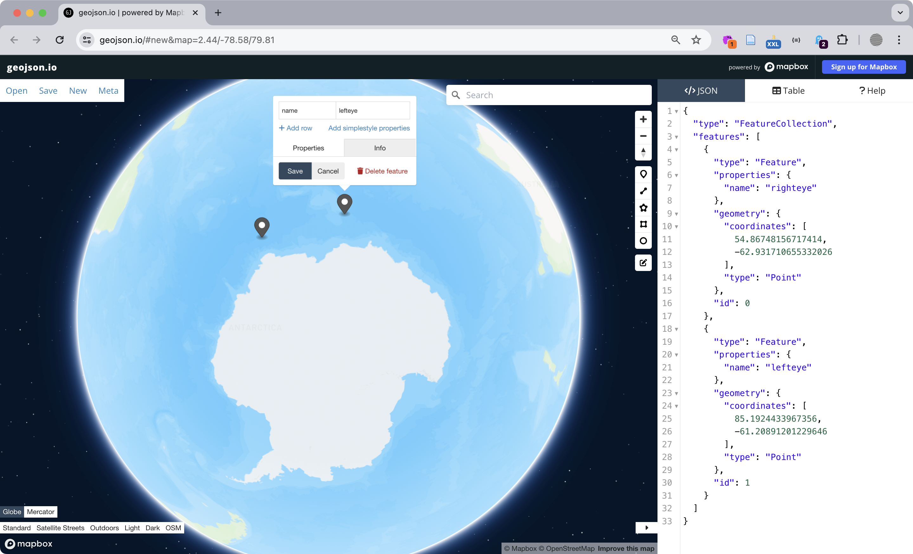
Figure 10.8 geojson.io is a user-friendly site for creating and formatting JSON map data.


Figure 10.9 GeoGoo https://geogoo.net by Jodi (Joan Heemskerk and Dirk Paesmans) is a wonderfully chaotic series of animations using the default icons of the Google Map API. Users can select from the dropdown options or simply refresh the page to load new iterations that visualize mathematical functions, symbols, or completely random designs across a variety of terrains and lunar surfaces. *While offline for a period, the site (thankfully) is live again.


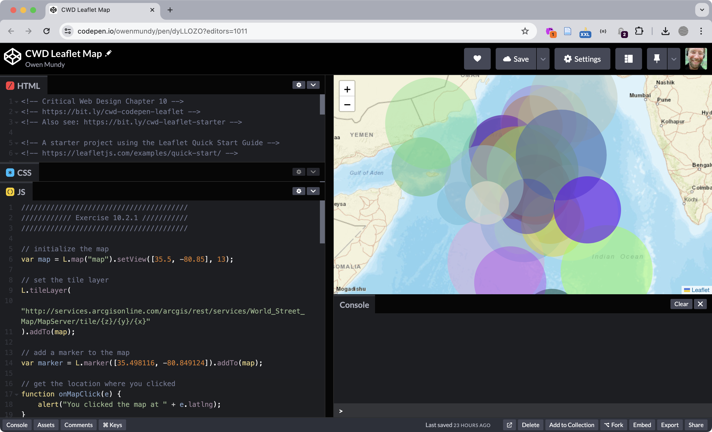
Figure 10.10 The result of exercises in 10.2 is a map populated with fake data using two libraries, Leaflet (for the map) and Faker.js (for the data). 


## 10.3 Data & Maps

```js
async function main() {
    let data = await fetchFeelings();
    console.log(data);
    await updateMap(data);
}

function updateMap(data) {
    removeMarkers();
    for (let i = 0; i < data.length; i++) {
        console.log(data[i]);
        markerLayer[i] = createMarker(data[i]);
    }
}
```


## 10.4 Using a Database - Bonus Module!


1. Create a new repo from our Big Feelings Starter template github.com/omundy/big-feelings-starter named big-feelings and then go to github.com/codespaces and open your new repository following our steps in exercise 3.2.1.
2. You’ll see the structure is similar to our Bad Password API, with a `api/server.js` and `api/routes.js` file. Open `api/database/mongodb.js`. The database code is organized in its own file to “separate the concerns” and organize our work by their specific tasks. This file will connect to the database and return a reference to let us save and retrieve data. You will see that the database functionality (e.g. to create and insert data in the table) has been wrapped with functions to make it easier to run the database queries. 


### Add data to the map

1. Next, we will connect the web form that lets users submit new data. In `main.js` find the `submitForm()` function. This is called when a user clicks submit. Add the following code to store the form data into a variable called data and log it. If you test your form in a new preview window you will see a JS object containing properties for each of the form’s inputs.

```js
function submitForm(e) {
    e.preventDefault();
    let data = getFormData();
    console.log(data);
}
```

2. We’ve already added a `/api/feeling` route on the server that will receive the request from the form and update the database. Look at it inside `routes.js` and you will notice it uses `server.post` instead of server.get. This means you will need to tell fetch to send this data to the server using a `POST` request. Open main.js and add the following to the bottom of `submitForm()` to create a new options object you can use with fetch that sets the method to `POST`, adds a special header to inform the server it is sending JSON, and stores the data from the form in body. The JSON.stringify() function is built into JS and essentially converts a data object to the text equivalent so it can be sent over the internet.

```js
function submitForm(e) {
    e.preventDefault();
    let data = getFormData();
    console.log(data);
    let options = {
        method: "POST",
        headers: {
        "Content-Type": "application/json",
        },
        body: JSON.stringify(data),
    };
}
```

3. Now add this fetch code below that sends the options containing the submitted data to the server. The route will return a new copy of the data, so we call the `updateMap()` function again and then a function called `showSuccessMsg()` to let the user know everything worked. You can test your project now, preferably in a new window so you can watch the console and make sure everything works.

```js
let options = {
    method: "POST",
    headers: {
      "Content-Type": "application/json",
    },
    body: JSON.stringify(data),
};
fetch("/api/feeling", options)
    .then((response) => response.json())
    .then(async (json) => {
    await updateMap(json);
            showSuccessMsg("Your feeling was added");
            });
```


<details>
<summary>Exercise 10.3.1 Create A SQLite Database</summary>


In this exercise you will use the command line and SQLite to create and insert information in a database using CRUD operations. SQLite is simple to use because it requires no special software to be installed on the server and saves the data in a single file. 

1. Remix our Big Feelings Starter https://github.com/criticalwebdesign/big-feelings-starter project. Open the Glitch Terminal and type the below and press return. This will open an SQLite session with a connection to a new SQLite database (test.db) inside a hidden folder called .data.

```bash
sqlite3 .data/test.db
```

2. Keywords with a period in front are special commands in SQLite. Type the following to see if there are any tables in the database. 

```bash
.tables
```

3. Commands without a preceding period are run as SQL queries. Run this query to add a table called people with three columns. Databases increase their storage efficiency by restricting the data type that can be stored in a column. 

```bash
CREATE TABLE people ( year INTEGER, first TEXT, last TEXT );
```

4. Insert a new row in the table using the below query. SQL requires a semicolon. If you forget and press return it will assume you are still typing the query. Simply type the semicolon and press return again.

```bash
INSERT INTO people VALUES ( 1838, "John", "Muir" );
```

5. Now you can query the database to retrieve the data. We’ll use the * symbol to select all entries from the people table.

```bash
SELECT * FROM people;
```

6. Add another row.

```bash
INSERT INTO people VALUES ( 1864, "Nellie", "Bly" );
```

7. Run the select query again but reverse sort the results by year.

```bash
SELECT * FROM people ORDER BY year DESC;
```

8. To exit the SQLite session, type the following.

```bash
.exit
```

9. List the contents of the .data directory and you will see your database file has been created (Figure 10.19). 

```bash
ls -la .data
```

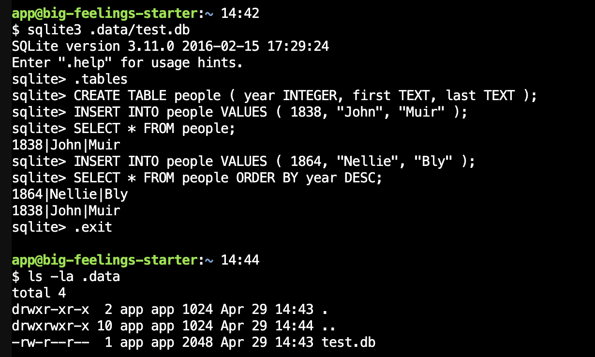
Figure 10.19 The results of exercise 10.3.1.


</details>


<details>
<summary>Exercise 10.3.2 Use Node.js and SQLite</summary>


Now that you have a fundamental understanding of how to create and query an SQLite database, in this exercise you will connect to and query the database using Node.js.

1. You remixed our Big Feelings Starter https://github.com/criticalwebdesign/big-feelings-starter in the previous exercise. You’ll see the structure is similar to our Bad Password API, with a server.js and routes.js file. Open database.js. The database code is organized in its own file to “separate the concerns” and organize our work by their specific tasks. This file will connect to the database and return a reference to let us save and retrieve data. You will see that the database functionality (e.g. to create and insert data in the table) you learned in the previous exercise has been wrapped with functions to make it easier to run the database queries. 
2. To use this file, open and go to the top of routes.js then import database.js with the following code before any other code. 

```js
import db from "./database.js";
```

3. You won’t notice a difference in the preview pane, but if you use the Terminal to list the files inside the .data directory you will see a new SQLite database file has been created.
 
```js
ls .data
```

4. Now you can add API routes that call the functions exported from database.js. Add the following to the routes function to retrieve data for the map. This route will use the db.getAll() function. It uses the await keyword to make sure and wait for the promise that queries the database to finish so that it has results before sending a reply, by returning data. Test this route now in a new browser window by going to <your-url>/api/feelings. You should see an empty array only because there is no data in the database, yet…

```js
server.get("/api/feelings", async function (request, reply) {
    let data = await db.getAll();
    return data;
});
```

5. Add this route to the bottom of the routes function in routes.js to add test data to the database. This route is not meant to send data back, we are enabling it to add test data only and then the Fastify server will redirect the browser back to the home page. To test this route you need to simply visit <your-url>/addTestData or click the link under the map (Figure 10.20).

```js
server.get("/addTestData", async function (request, reply) {
    await db.addTestData();
    reply.redirect("/");
});
```


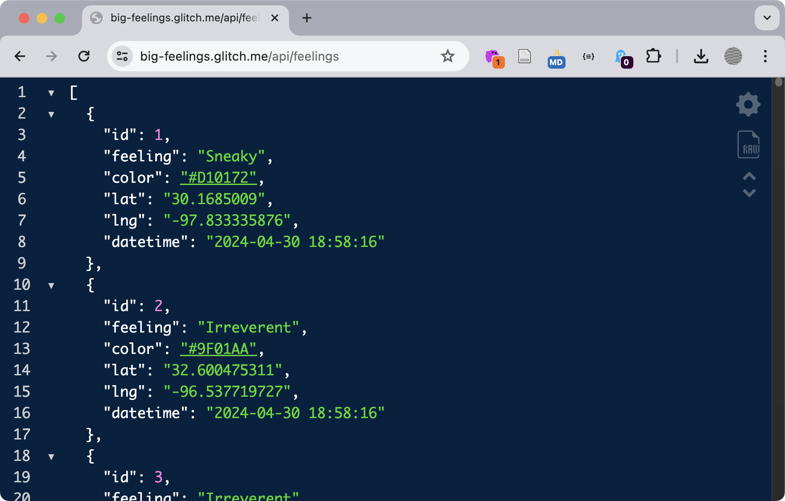
Figure 10.20 Data in JSON format for our Big Feelings project. 


### SQLite Tips

- [SQLite](Resources#json)
- Check a database file exists (in .data directory) `ls -la .data`
- Delete (reset) a database `rm .data/sqlite.db` 
- Dump a table `sqlite3 .data/sqlite.db "select * from People"`
- Dump a table into an html file `sqlite3 .data/sqlite.db "select * from People" > export.html`

</details>


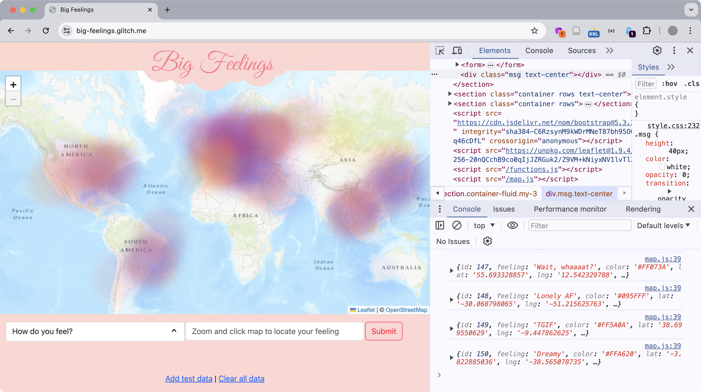
Figure 10.21 Markers appear on the map for each feeling, seen in the console with unique IDs.


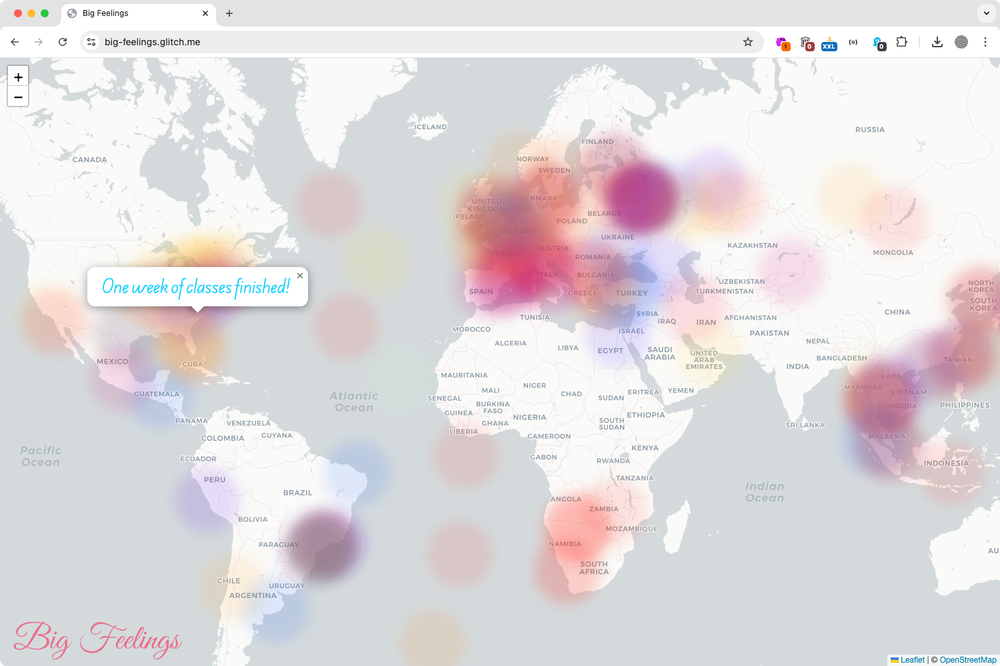
Figure 10.22 The final version of the prompt for Chapter 10 can be found online https://big-feelings.vercel.app


<!-- 
Figure 10.23 The International Pussycats (in-progress) is a virtual post-punk band made with methods outlined in this chapter.  -->


https://www.mongodb.com/developer/languages/javascript/node-crud-tutorial/
https://www.mongodb.com/developer/code-examples/javascript/node-connect-mongodb-3-3-2/
https://northflank.com/guides/connecting-to-a-mongo-db-database-using-node-js