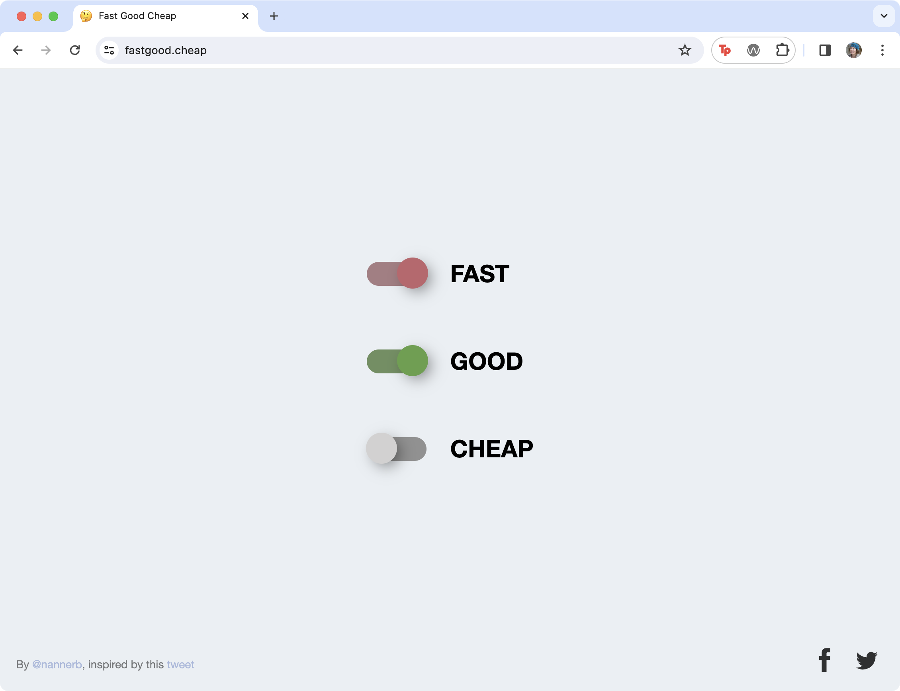

## Context 

Chapter 11 is the coda to this text. We offer readers places where they might exhibit or showcase works made using the skills they have learned throughout the book, as well as resources and advice for the labor market.

## 11.1 Continue Learning and Sharing

### Keep Playing

The following playgrounds and coding communities are terrific places to continue to play and experiment. While we are light-heartedly referring to this as an “exercise” we do not have distinct directions. Simply follow the URL and explore!

- Take a look at projects from the community at Codepen Spark https://codepen.io  
- Participate in a game jam at Itch https://itch.io or the Interactive Fiction Database https://ifdb.org 
- Take a free Javascript course online with Codecademy https://www.codecademy.com 
- Watch The Coding Train series by Daniel Shiffman https://www.youtube.com/channel/UCvjgXvBlbQiydffZU7m1_aw 
- Read a free JS book like Eloquent Javascript https://eloquentjavascript.net
- Join a hackathon like https://bangbangcon.com/ or https://stupidhackathon.com/ 
- Read an article about design or art https://readings.design or https://monoskop.org

### Keep Looking

A healthy part of any creative practice is to be aware of what else is going on. Whether you are finding work online or offline at museums, exhibitions, festivals, there are many places to find inspiring and thought-provoking works. 

- https://whitney.org/artport
- https://anthology.rhizome.org
- https://docubase.mit.edu 
- https://experiments.withgoogle.com 
- https://arebyte.com
- https://singleservingsites.cool 
- https://generative-unfoldings.mit.edu 
- https://fckyeahnetart.tumblr.com/archive  
- https://esoteric.codes
- https://arttab.xyz/web/explore 

### Stay Connected

The following organizations have a legacy of bringing new digital and interactive works to viewers spanning net.art, speculative design, interactive stories, and other new media works. 

- Ars Electronica https://ars.electronica.art (Austria) is an annual festival for art and technology 
- Electronic Literature Organization https://eliterature.org (international) is a conference and media arts festival for digital literature 
- Eyebeam https://eyebeam.org (NYC) is an art and technology center
- HASTAC, https://hastac.hcommons.org (Humanities, Arts, Science, and Technology Alliance and Collaboratory, pronounced “haystack”) is an organization that supports scholars and hosts conferences that include panels, roundtables, discussions, and art exhibitions.
- ISEA https://www.isea-international.org (international) is an academic technology symposium on electronic art
- NEW INC https://www.newinc.org (NYC) is an incubator for people working at the intersection of art, design, and technology
- Rhizome https://rhizome.org (NYC) supports new media art through exhibitions, scholarships, and preservation
- The School for Poetic Computation (NYC) supports experimental study in art, code, hardware, and critical theory https://sfpc.study 
- Akademie Schloss Solitude (Germany) Web Residencies supports web-based practices https://schloss-post.com/overview/web-residencies 
- Transmediale (Germany) is an annual technology festival https://transmediale.de/en
- xCoAx, https://xcoax.org is an annual, international conference on “computation, communication, aesthetics & X” that includes panels and an art exhibition.

### Explore Journals

- The New River, https://thenewriver.us is a journal promoting digital art and writing
- Media-N, https://iopn.library.illinois.edu/journals/median is the peer-reviewed, open-access journal of the College Art Association’s New Media Caucus
- The Journal for Artistic Research (JAR), https://jar-online.net/en is an open-access journal that disseminates artistic research from all disciplines, but offers unique and creative methods for displaying digital media. 
- Neural, https://neural.it (1993–) is a magazine about critical digital culture and media arts
- Nettime, https://nettime.org is a (1995–) list-serv promoting the discussion of networked cultures, policies, and tactics.
- New Media Curating, https://www.jiscmail.ac.uk/cgi-bin/webadmin?A0=new-media-curating is a list-serv (2001–) intended for those involved in curating, exhibiting, archiving or interpreting new media 
- Taper, https://taper.badquar.to is an online literary magazine for small computational pieces, published by Nick Montfort’s small press, Bad Quarto https://badquar.to 

## 11.2 Professional Practices

### Servers and Hosting

Full-stack platforms with a free tier

- https://vercel.com
- https://codesandbox.io  
- https://stackblitz.com
- https://netlify.com
- [Glitch](https://glitch.com) [R.I.P.](https://www.theverge.com/news/673457/glitch-coding-platform-shutting-down) [😢](https://blog.glitch.com/post/changes-are-coming-to-glitch/)

### Professional Practices

- The website fastgood.cheap only allows the user to select two of the three options at a time. This commentary on design suggests a more respectful consideration for how clients engage with the design industry. Alas, it’s not possible to deliver on all three objectives.
- http://www.shouldiworkforfree.com offers a fun but honest take on how you may consider business opportunities.
- AIGA's resources https://www.aiga.org/resources/business-freelance-resources

## 11.3 How to Be Brave

> Just be brave and make the work. Don’t worry about gate-keepers giving you permission or validating your ideas.

